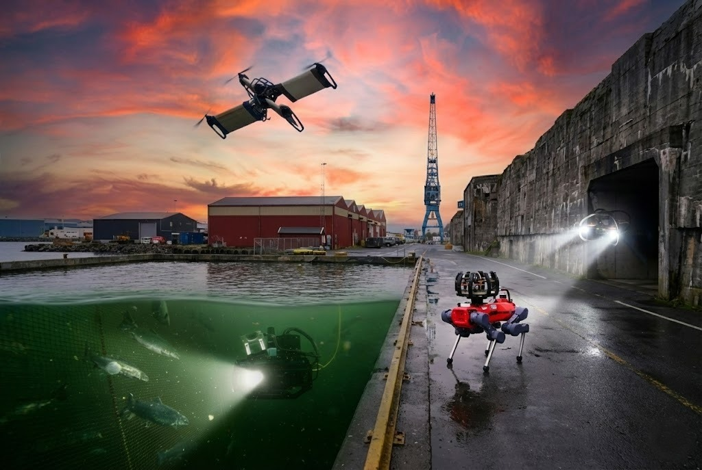

# Unified Autonomy Stack

**Paper**: [The Unified Autonomy Stack: Toward a Blueprint for Generalizable Robot Autonomy](https://arxiv.org/abs/2605.12735)

**Video**: [Unified Autonomy Stack - Overview](https://www.youtube.com/watch?v=l8Su8OXsM-E)

**Playlist**: [Unified Autonomy Stack - Experiments and Evaluations](https://www.youtube.com/watch?v=8nVnXTUH2Hc&list=PLu70ME0whad9KCs5PHx-35-qpyK14yZYi&index=2)

Welcome to the documentation for the **Unified Autonomy Stack**. 
This stack presents an autonomy architecture integrating perception, planning, and navigation algorithms developed and field tested at the [Autonomous Robots Lab](https://www.autonomousrobotslab.com) across robot configurations. The stack consists of the software for the core algorithms along with drivers, utilities, and tools for simulation and testing. We currently support rotary-wing (e.g., multirotor) and certain ground systems (e.g., legged robots) with extension to other systems, such as underwater robots, coming soon. The software distributed as a part of this stack has been thoroughly tested in real-world scenarios demonstrating robust autonomous operation in challenging GPS-denied environments.



## Documentation

The documentation of the Unified Autonomy Stack is available at [https://ntnu-arl.github.io/unified_autonomy_stack/](https://ntnu-arl.github.io/unified_autonomy_stack/).

## Citation
If you use the Unified Autonomy Stack in your research, please consider citing the following paper:

```
@article{unifiedautonomystack2026,
  title={The Unified Autonomy Stack: Toward a Blueprint for Generalizable Robot Autonomy},
  author={Dharmadhikari, Mihir and Khedekar, Nikhil and Kulkarni, Mihir and Nissov, Morten and Jacquet, Martin and Zacharia, Angelos and Harms, Marvin and Puigjaner, Albert Gassol and Weiss, Philipp and Alexis, Kostas},
  journal={arXiv preprint arXiv:2605.12735},
  year={2026}
}
```

[](https://doi.org/10.5281/zenodo.20991859)


## Contact

- Mihir Dharmadhikari: [mihir.dharmadhikari@ntnu.no](mailto:mihir.dharmadhikari@ntnu.no)
- Nikhil Khedekar: [nikhil.v.khedekar@ntnu.no](mailto:nikhil.v.khedekar@ntnu.no)
- Mihir Kulkarni: [mihir.kulkarni@ntnu.no](mailto:mihir.kulkarni@ntnu.no)
- Morten Nissov: [morten.nissov@ntnu.no](mailto:morten.nissov@ntnu.no)
- Angelos Zacharia: [angelos.zacharia@ntnu.no](mailto:angelos.zacharia@ntnu.no)
- Martin Jacquet: [martin.jacquet@ntnu.no](mailto:martin.jacquet@ntnu.no)
- Albert Gassol Puigjaner : [albert.g.puigjaner@ntnu.no](mailto:albert.g.puigjaner@ntnu.no)
- Philipp Weiss: [philipp.weiss@ntnu.no](mailto:philipp.weiss@ntnu.no)
- Kostas Alexis: [konstantinos.alexis@ntnu.no](mailto:konstantinos.alexis@ntnu.no)
