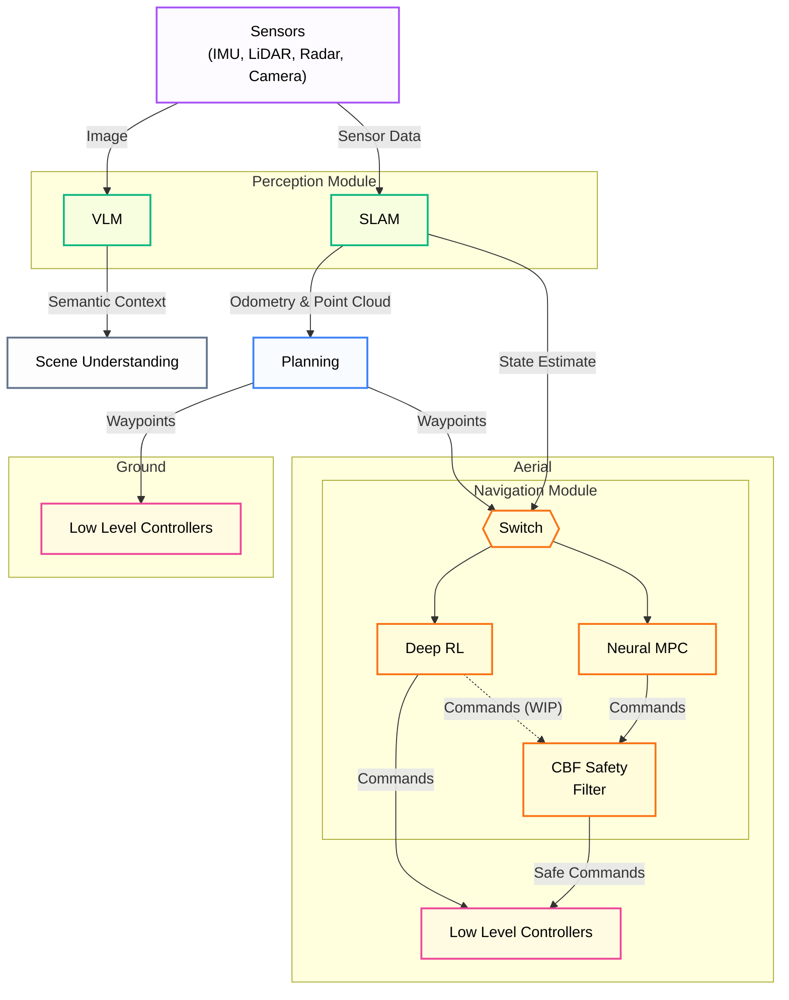

# General Architecture

The Unified Autonomy Stack implements a modular, containerized autonomy pipeline designed for robust exploration and navigation in subterranean and industrial environments. This document details the specific software components, data flows, and interfaces implemented in this repository.

## System Overview

The stack is composed of four primary subsystems, distributed across ROS (Noetic) and ROS 2 (Humble) environments. Communication between these distinct ecosystems is handled by a dedicated `ros1_bridge`.

The Unified Autonomy Stack employs a modular architecture with layered safety guarantees, where each component consumes the outputs of upstream modules while maintaining graceful degradation under partial failures. At the foundation, the **Perception Module** includes our solution for multi-modal [SLAM](slam.md){data-preview}, alongside integration with a [VLM](vlm.md){data-preview}-based reasoning step. The multi-modal SLAM (dubbed MIMOSA) uses a factor graph estimator to fuse IMU preintegration with LiDAR, radar, and visual odometry factors in a windowed smoother. By design, the system continues to provide state estimates even when individual sensor modalities fail—radar sustains operation in dust and smoke where LiDAR degrades, while IMU integration bridges temporary exteroceptive dropouts.

State estimates and motion-compensated point clouds flow downstream to the [**Planning Module**](planning.md){data-preview}, which constructs a TSDF volumetric map, and an elevation map for ground robots, to compute trajectories for exploration, inspection, or waypoint navigation. The graph-base path planner **GBPlanner3** is used at the core of the **Planning Module**, that has been tested and deployed across robot configurations in different environments.

The [**Navigation Module**](navigation.md){data-preview} transforms geometric waypoints given by the **Planning Module** into dynamically feasible commands through a [Neural SDF-NMPC](nmpc.md){data-preview} formulation that solves a receding-horizon optimal control problem with collision constraints derived from a VAE-based learned distance field. An alternative [Deep Reinforcement Learning-based](rl.md){data-preview} policy provides velocity commands directly from LiDAR observations, enabling continued operation if the MPC solver fails or latency becomes excessive. Both approaches embed obstacle avoidance directly, providing a first layer of collision protection independent of downstream filters. The [Composite CBF Safety Filter](cbf.md){data-preview} enforces the final safety guarantees prior to actuation. For aerial platforms, a Control Barrier Function filter minimally modifies commanded accelerations via quadratic programming to maintain forward invariance of a safe set, rejecting any command—regardless of its source—that would violate proximity constraints.

Commands are then dispatched to the PX4 autopilot through MAVROS, which provides its own onboard failsafes. Ground robots bypass the Navigation Module and interface the commanded path directly with the robot controllers. Inter-process communication between ROS and ROS 2 components is handled by a dedicated bridge node.

## Deployment Architecture

The system is deployed as a set of Docker containers, following the instructions listed in [Deployment](deployment.md){data-preview}.
