## Overview

<iframe width="100%" style="aspect-ratio: 16/9" src="https://www.youtube.com/embed/l8Su8OXsM-E?si=Ip9ObjBuDDnSGgBB" title="YouTube video player" frameborder="0" allow="accelerometer; autoplay; clipboard-write; encrypted-media; gyroscope; picture-in-picture; web-share" referrerpolicy="strict-origin-when-cross-origin" allowfullscreen></iframe>

## Robot Platforms

The following robot platforms are used across these evaluations. In all missions, the full autonomy stack runs fully onboard in real-time.

| Platform | Type | Compute | Sensors |
|---|---|---|---|
| **AR1** | Multirotor (RMF-Owl) | Khadas Vim4 | Ouster OS0-128 LiDAR, Flir Blackfly 0.4 MP camera, TI IWR6843AOP radar, VectorNav VN-100 IMU |
| **AR2** | Collision-tolerant quadrotor (0.52×0.52×0.24 m, 2.3 kg) | UniPilot (Jetson Orin NX) | RoboSense Airy dome LiDAR, 3× IMX296 cameras, RS-6843AOPU radar, VectorNav VN-100 IMU |
| **GR1** | Legged robot (ANYmal D, 50 kg) | UniPilot (Jetson Orin NX) | RoboSense Airy dome LiDAR, 3× IMX296 cameras, RS-6843AOPU radar, VectorNav VN-100 IMU |

AR1 is used for three of the four SLAM evaluation flights (Fyllingsdal, Runehamar, Frozen Lake). The Campus Fog SLAM dataset was collected with a separate handheld modified UniPilot carrying a Hesai JT-128 LiDAR and uRAD Industrial radar. AR2 is used for all autonomous aerial missions. GR1 is used for all legged missions.

## SLAM Module Evaluation

<iframe width="100%" style="aspect-ratio: 16/9" src="https://www.youtube.com/embed/8nVnXTUH2Hc?si=kK2plzOz8Fwy5qfU" title="YouTube video player" frameborder="0" allow="accelerometer; autoplay; clipboard-write; encrypted-media; gyroscope; picture-in-picture; web-share" referrerpolicy="strict-origin-when-cross-origin" allowfullscreen></iframe>

### Multi-Modal SLAM

The SLAM module (MIMOSA-X) is evaluated across four perceptually-degraded environments, comparing uni-modal ablations against the full multi-modal fusion (LiDAR + Radar + IMU, **LRI**) and state-of-the-art baselines. The LRI configuration is the default for all autonomous missions.

#### Tunnels (Fyllingsdal & Runehamar)

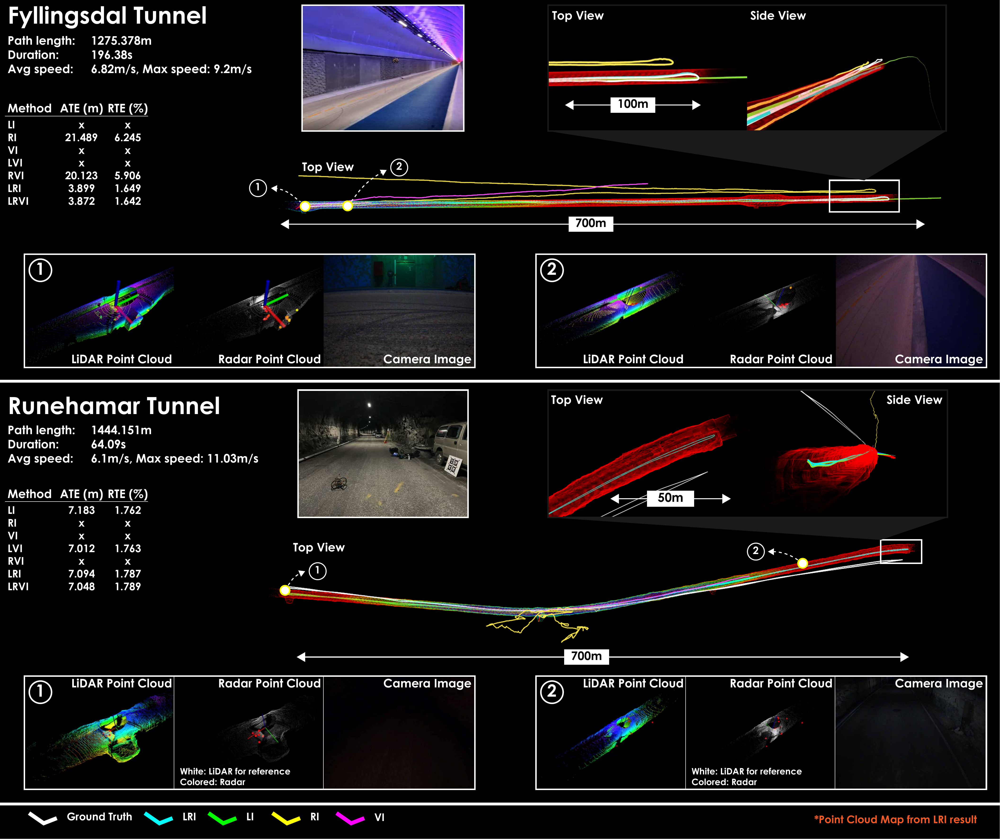

**Fyllingsdal tunnel** (~650 m, avg. 6.8 m/s): Long geometrically self-similar sections cause LiDAR-only methods (FAST-LIO2, **Ours-LI**) and AF-RLIO to fail. GaRLIO could not be evaluated as its implementation requires the radar and LiDAR to operate at the same rate, which is not the case here (radar runs at 25 Hz in this experiment). High speeds cause significant deterioration for ROVIO, so **Ours-VI** also fails and **Ours-RVI** does not improve significantly over **Ours-RI**. OpenVINS outperforms ROVIO, **Ours-VI**, **Ours-RVI**, and **Ours-LVI**, but does not reach the accuracy of **Ours-LRI** and **Ours-LRVI**. FAST-LIVO2 achieves performance similar to, but slightly worse than, **Ours-LRI** and **Ours-LRVI**. **Ours-LRI** and **Ours-LRVI** perform best.

**Runehamar tunnel** (~1.4 km): Rough interior supports LiDAR-based methods, but dark unlit sections degrade vision (poor ROVIO, FAST-LIVO2 slightly worse than FAST-LIO2). Sparse radar returns mean radar-only ablations also struggle. Combining LiDAR with radar or vision (**LVI**, **LRI**, **LRVI**) restores robust performance.

#### Frozen Lake

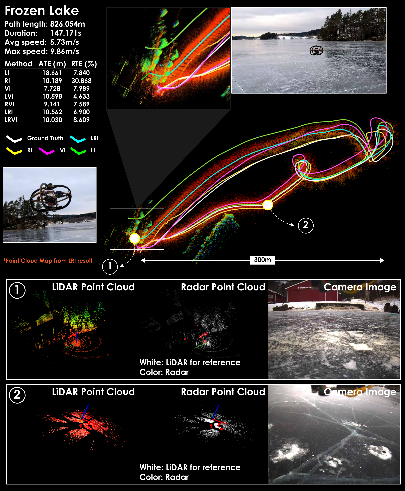

Once the robot moves away from the bank, the LiDAR returns a nearly planar point cloud (degenerate geometry) and the radar returns fewer than three points per scan (frequently empty). GaRLIO fails immediately as it requires a minimum of three radar points for its RANSAC-based velocity estimate. AF-RLIO functions initially but quickly breaks due to the sparse radar point clouds. Both FAST-LIO2 and FAST-LIVO2 function initially but fail after an aggressive yaw maneuver, accumulating significant error. Vision-based methods (OpenVINS, ROVIO) perform best among the baselines due to good outdoor lighting and a visually feature-rich environment. **Ours-LI**, **Ours-RI**, and **Ours-LRI** remain functional, and vision-inclusive ablations (**VI**, **LVI**, **RVI**, **LRVI**) retain performance comparable to the vision-only baselines.

#### Campus with Fog

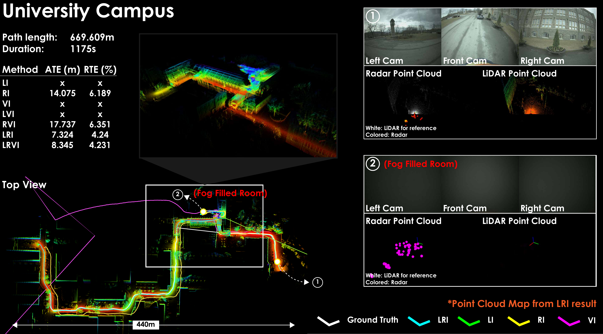

A handheld UniPilot (670 m trajectory) passes through a fog-filled room, blinding the LiDAR and camera. All LiDAR- and vision-based methods (FAST-LIO2, FAST-LIVO2, ROVIO, OpenVINS, **LI**, **VI**, **LVI**) accumulate large errors in the fog. GaRLIO and AF-RLIO also fail despite having radar, due to RANSAC sparsity issues and reliance on scan registration. Ablations that include radar (**RI**, **RVI**, **LRI**, **LRVI**) remain robust, with LiDAR+radar combinations performing best.

### VLM Scene Reasoning

<iframe width="100%" style="aspect-ratio: 16/9" src="https://www.youtube.com/embed/V_HpBROjocQ?si=zQHqMC9HhOxKcgFD" title="YouTube video player" frameborder="0" allow="accelerometer; autoplay; clipboard-write; encrypted-media; gyroscope; picture-in-picture; web-share" referrerpolicy="strict-origin-when-cross-origin" allowfullscreen></iframe>

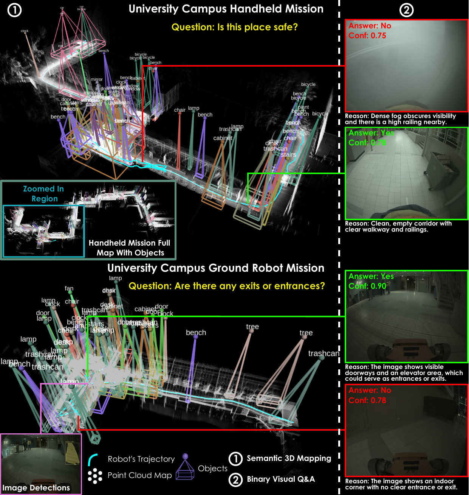

The VLM reasoning system combines open-vocabulary 3D semantic mapping (YOLOe / GPT-5 detections fused into a LiDAR voxel grid) with binary visual Q&A (GPT-5, queried every 50 s). End-to-end inference latency across evaluations: **5.66 ± 1.55 s**. The figure shows labeled 3D bounding boxes from the semantic map (left) alongside Yes/No Q&A examples with confidence scores (right), demonstrating the system correctly identifies unsafe fog conditions and scene features.

---

## Navigation Module Evaluation

<iframe width="100%" style="aspect-ratio: 16/9" src="https://www.youtube.com/embed/bleQPb1kVI8?si=9TGLBMN8Vmt8bSOx" title="YouTube video player" frameborder="0" allow="accelerometer; autoplay; clipboard-write; encrypted-media; gyroscope; picture-in-picture; web-share" referrerpolicy="strict-origin-when-cross-origin" allowfullscreen></iframe>

Two navigation policies — Neural MPC (**SDF-NMPC**) and exteroceptive deep RL (**ExRL**) — are paired with a Control Barrier Function (**CCBF**) as a last-resort safety layer. The evaluations below isolate the navigation module before showing full-stack missions.

### Waypoint Navigation in Forest (Navigation to Waypoint)

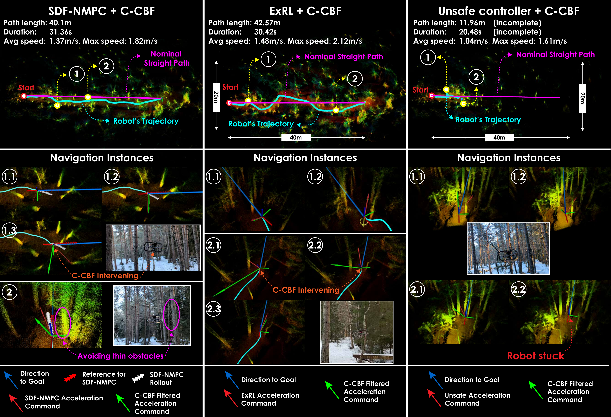

AR2 is tasked to navigate to a waypoint 38 m ahead through trees, with a straight-line reference path but without a map-based planned path from the planner. Three configurations are compared: **SDF-NMPC + CCBF**, **ExRL + CCBF**, and an **unsafe policy + CCBF** (SDF-NMPC with collision-avoidance constraints disabled, so CCBF is the sole safety mechanism).

- Both **SDF-NMPC + CCBF** and **ExRL + CCBF** reach the goal while avoiding all obstacles.
- The CCBF intervened only a few times; when engaged, the robot centroid was on average **0.65 m** from obstacles.
- The unsafe policy + CCBF gets stuck but remains safe — the CCBF prevents collisions but cannot drive progress toward the goal.
- **SDF-NMPC** tracks the straight-line reference closely; **ExRL** deviates more but achieves higher speeds, resulting in comparable mission times.

### Moving Obstacles in Building Basement

AR2 explores a university basement. At two separate points the planner's path is intentionally blocked by a newly placed obstacle (the planner is not re-triggered). The navigation layer must react in real time.

#### SDF-NMPC + CCBF

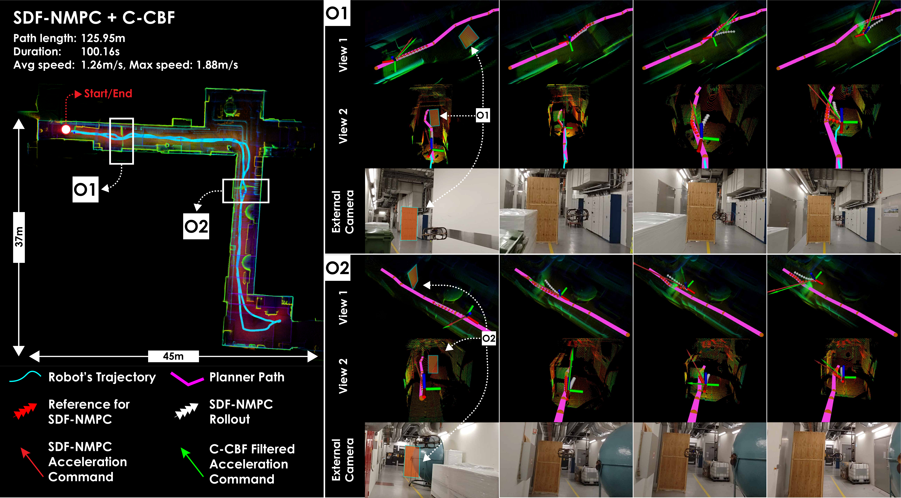

SDF-NMPC avoids the unseen obstacles with minimal path deviation, staying close to the reference. Its formulation minimises deviation from the planned path, so clearance is tight but safe.

#### ExRL + CCBF

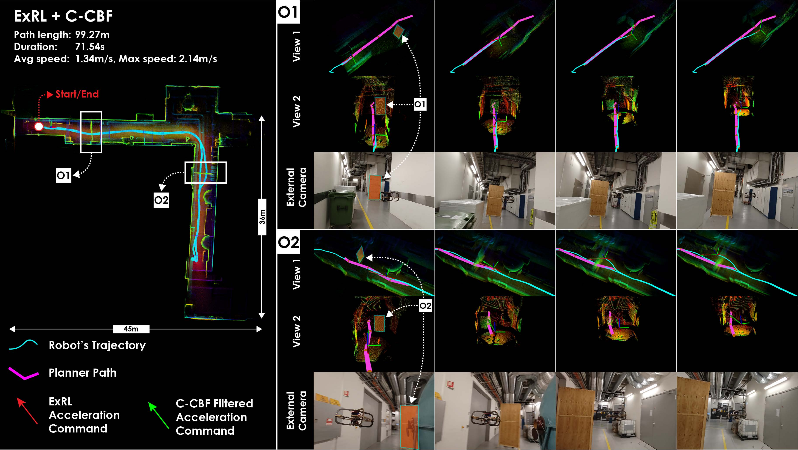

ExRL avoids the same obstacles with larger lateral deviation since it only aims to reach the end of the planned path, not track it precisely. Both configurations successfully complete the mission without collision.

---

## Full Stack Evaluation - Aerial Robots

<iframe width="100%" style="aspect-ratio: 16/9" src="https://www.youtube.com/embed/wpTowfX5t3I?si=cdaaE9iQtoF0TnUX" title="YouTube video player" frameborder="0" allow="accelerometer; autoplay; clipboard-write; encrypted-media; gyroscope; picture-in-picture; web-share" referrerpolicy="strict-origin-when-cross-origin" allowfullscreen></iframe>

Full-stack missions exercise the coordinated interaction of all three modules: **Perception** (MIMOSA-X SLAM + mapping), **Planning** (graph-based exploration / inspection), and **Navigation** (SDF-NMPC or ExRL + CCBF).

### Underground Mine (Løkken)

AR2 is deployed in a 3-way intersection of the Løkken mine (Norway). The narrowest branch is only 1.5 m wide, lighting is poor, and the dome LiDAR FOV can become degenerate in tight passages.

**SDF-NMPC:**

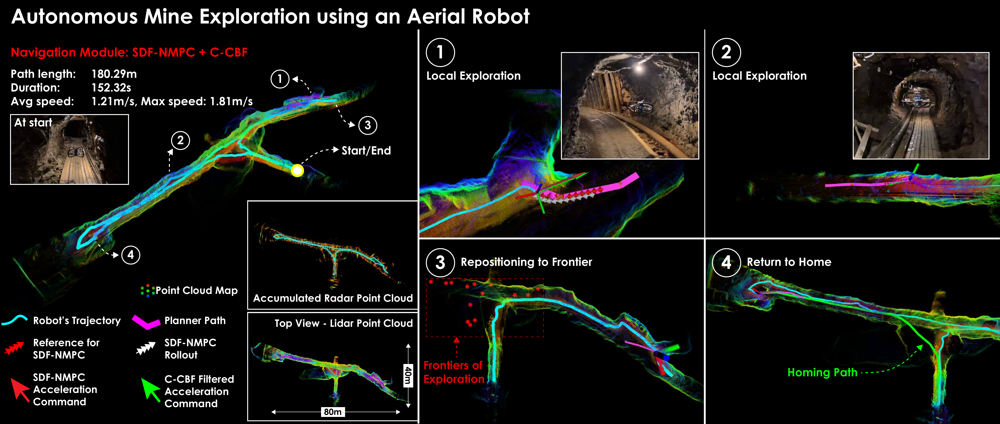

SDF-NMPC tracks the planned path closely, resulting in near-zero CCBF interventions. The robot explores all three branches and returns to the start.

**ExRL:**

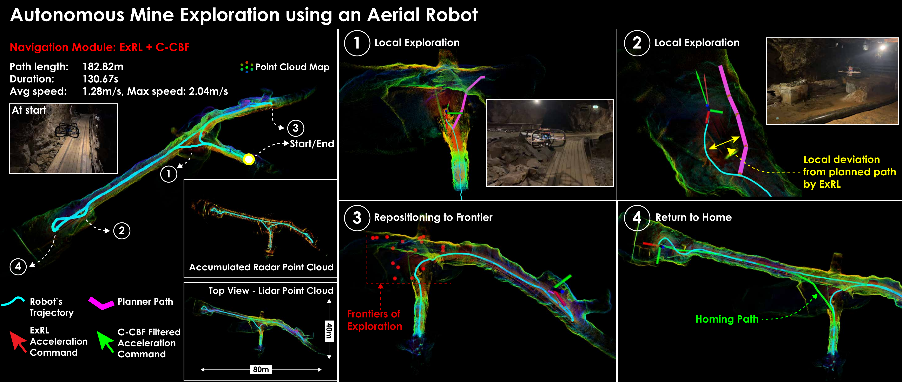

ExRL shows larger local deviations from the planned path but remains safe throughout and finishes faster due to higher attained speeds.

In the narrowest section near the start, brief oscillations arise from competing SDF-NMPC/ExRL and CCBF objectives (path progress vs. pure safety) — the system always recovers and continues.

### Forest (Trondheim)

AR2 explores a 120 × 80 m snowy forest (height capped at 2.5 m) with trees of varying density including thin branches.

**SDF-NMPC:**

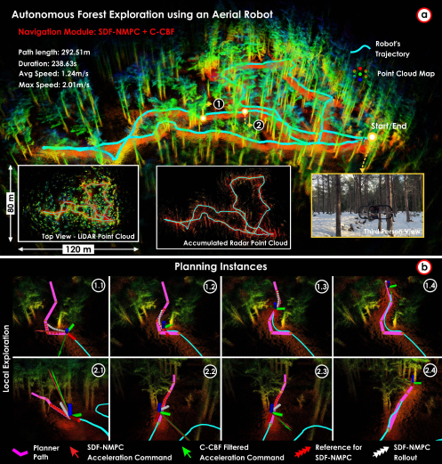

**ExRL:**

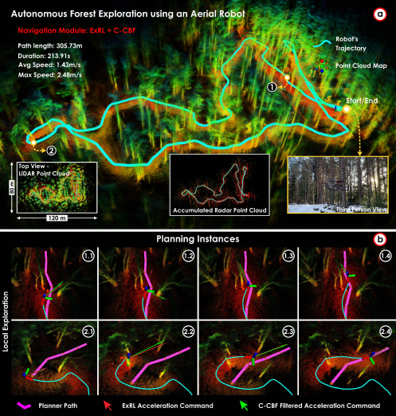

SDF-NMPC follows the planner paths more precisely; ExRL generates smoother, faster trajectories with greater deviation. Both complete the mission safely. The CCBF intervened at one instance in the ExRL run (robot centroid **0.68 m** from obstacle, velocity toward obstacle **1.10 m/s**), illustrating the value of the last-resort safety layer near thin branches.

### Ship Cargo Hold (Inspection)

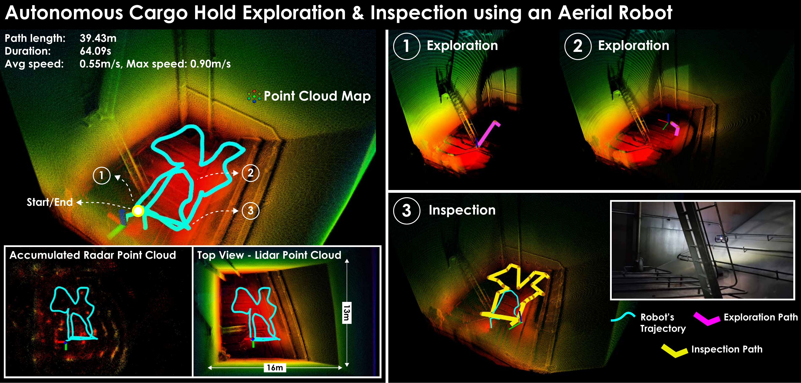

AR2 is deployed inside a 16 × 13 × 15 m oil tanker cargo hold (mission height capped at 3 m). Starting with no prior map, the robot first explores the hold and then switches to the **Inspection** behavior, systematically viewing mapped surfaces at a desired camera distance. Navigation safety policies were disabled here as the environment has no internal obstacles, allowing more flexible motion during inspection.

## Full Stack Evaluation - Legged Robot

<iframe width="100%" style="aspect-ratio: 16/9"  src="https://www.youtube.com/embed/TC2E_c73yC0?si=pTwSZerzHbgJbjmY" title="YouTube video player" frameborder="0" allow="accelerometer; autoplay; clipboard-write; encrypted-media; gyroscope; picture-in-picture; web-share" referrerpolicy="strict-origin-when-cross-origin" allowfullscreen></iframe>

### Underground Mine (Løkken)

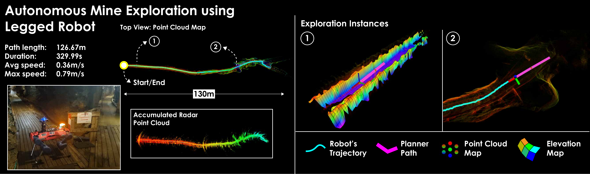

GR1 explores a mine shaft with narrow cross-sections and side gaps. The dual map representation (volumetric + elevation map) enables traversability-aware planning that handles the uneven terrain. Navigation safety layers are not used here as ANYmal's onboard perceptive locomotion provides analogous near-term collision avoidance.

### University Building (NTNU)

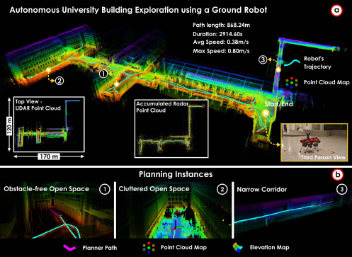

GR1 explores a full building floor comprising a large open hall with offshoots and a network of narrow corridors (width < 1.5 m). The robot navigates from the open section into the corridors and returns to the start. Multi-modal SLAM provides resilient odometry in the geometrically self-similar narrow passages, and the bifurcated planner (volumetric + elevation maps) handles the large scale variation and branching topology.

---

<!-- 
### Older Results

#### Manual Flight (Runehamar Tunnel)

Here an aerial platform with VectorNav VN-100 IMU, Ouster OS0-128 LiDAR, and Texas Instruments IWR6843AOP Radar flying manually through the Runehamar tunnel in Norway. The performance of the LiDAR-radar-inertial fusion can be see in the aggregated point cloud map. Note, the estimate experiences some vertical drift due to difficulties with respect to bias observability, exaggerated by the large distance traveled by the mission.

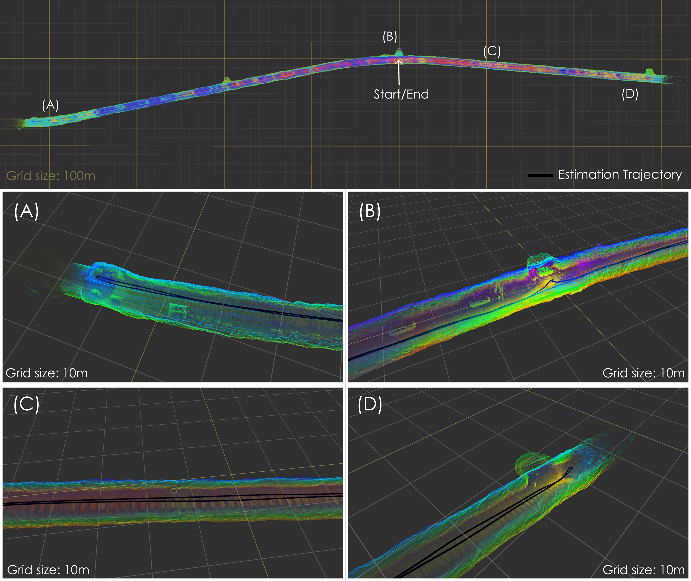

**Metadata**:

- Distance: 1444 m
- Maximum Velocity: 11 m/s

#### Exploration

##### Runehamar Tunnel

In the same environment, we conduct exploration missions with the autonomy stack, executed with the UniPilot module mounted on a quad rotor frame. Here you can see the path it executes, starting at the entrace and continuing onwards into the tunnel, before turning around and returning to home.

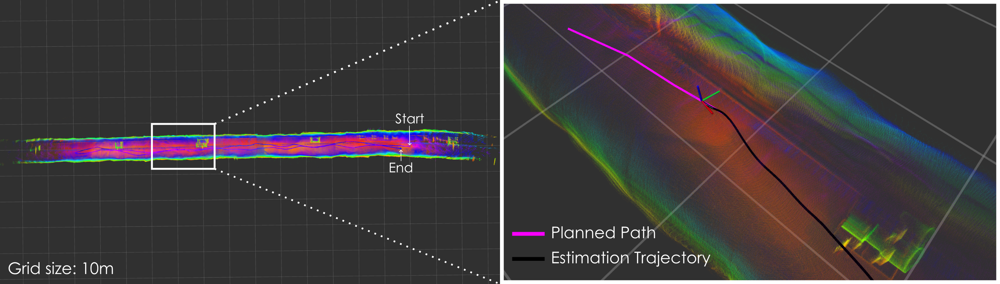

**Metadata**:

- Distance: 270 m
- Maximum Velocity: 1.9 m/s

##### Løkken Mine

Here we show an exporation mission conducted with the UniPilot module in the Løkken mine. Note, the estimation and planning performance as it transitions from a small, confined corridor out to a large, open space and back again for homing. In the second figure, the aggregated point cloud of the radar can be seen instead. Clearly, the points are significantly noisier than the corresponding map for the LiDAR.

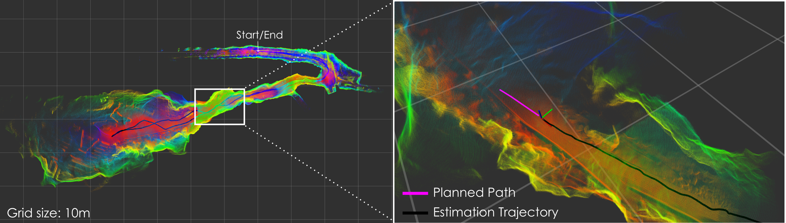

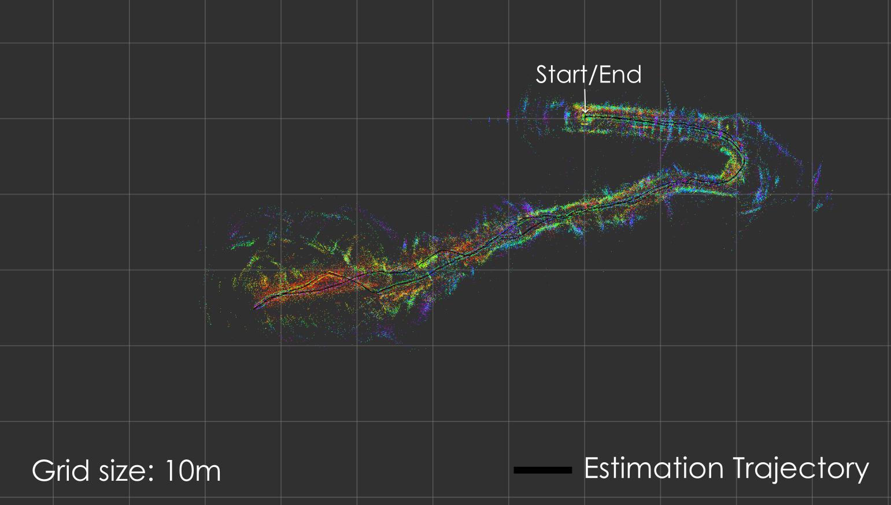

**Metadata**:

- Distance: 197 m
- Maximum Velocity: 1.1 m/s

#### Changing the Environment

Although the planner ensures collision free paths, if the environment were to change a given path may no longer be collision free. In this series of experiments, we conduct exploration missions in a cluttered basement corridor, and intentionally sabotage the planner at two distinct points. Both the NMPC- and RL-based safety methods ensure the aerial platform continues safely, when the planners path is compromised.

##### NMPC

Here you can see the NMPC, ensuring safety, by pushing the aerial platform away from the planned path to avoid an object put to cause collision with the path from the planner.

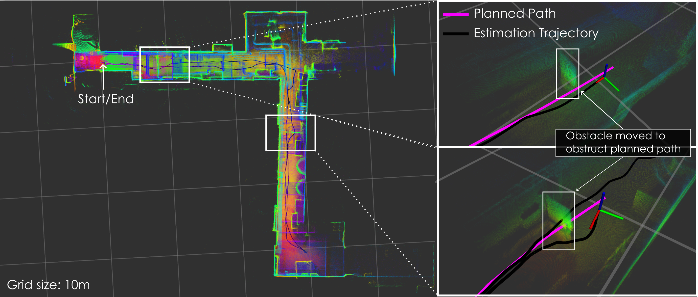

**Metadata**:

- Distance: 125 m
- Maximum Velocity: 1.8 m/s

##### RL

Here you can see the RL policy, ensuring safety, by pushing the aerial platform away from the planned path to avoid an object put to cause collision with the path from the planner.

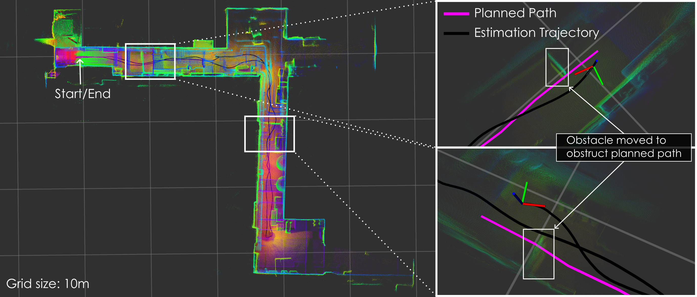

**Metadata**:

- Distance: 125 m
- Maximum Velocity: 2.1 m/s

#### Legged Robot

The UniPilot with the Unified Autonomy Stack is deployed on the ANYmal D legged robot tasked to explore a part of a university building. The mission involved navigation through both wide open and narrow corridors. The long narrow geometry of the narrow corridors can render a LiDAR only or LiDAR-inertial method to become degenerate. However, through the fusion of radar, the robot is able to resiliently localize and complete the mission.

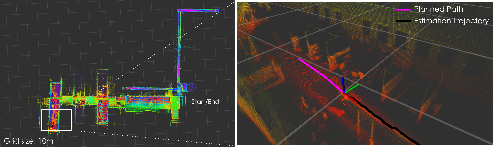

**Metadata**:

- Distance: 873 m
- Maximum Velocity: 1.1 m/s

--- -->