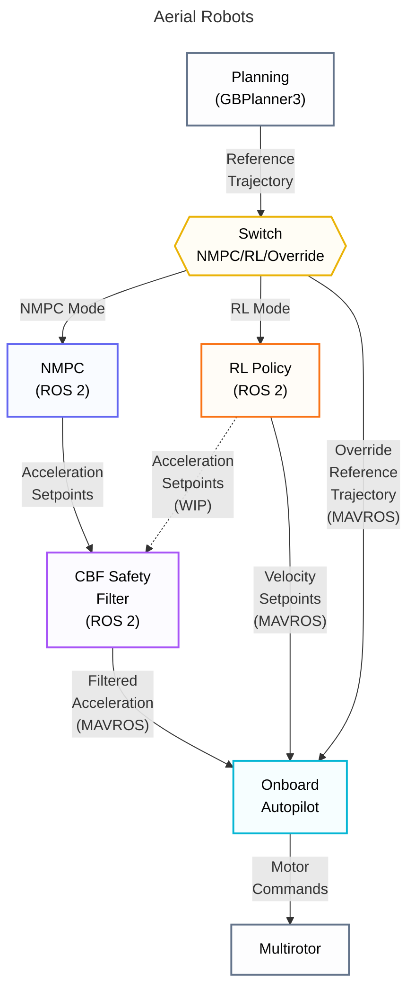
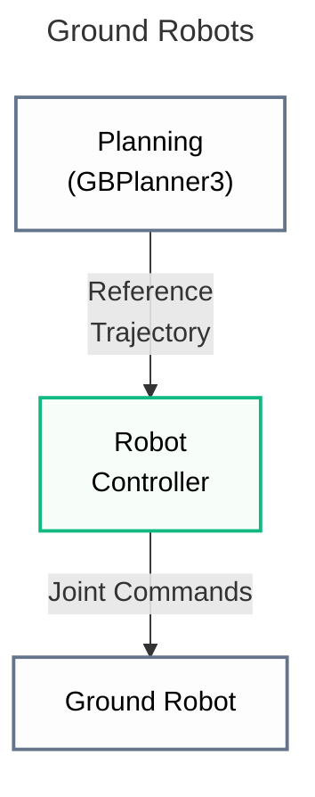

# Navigation & Control

- See [Navigation](#navigation) below.
    - [Neural MPC (NMPC)](nmpc.md)
    - [Reinforcement Learning (RL)](rl.md)
- See [Control (CBF safety layer)](cbf.md) below.

## Navigation

The Unified Autonomy Stack takes a multi-layered approach to safety. Conventionally, safe navigation relied solely on map-based path planning—a single point of failure that could lead to collisions due to odometry drift or incomplete mapping (e.g., thin obstacles). While the stack maintains map-based avoidance as its core approach, it adds reactive safety layers through two complementary methods:

1. **[Neural SDF-NMPC](nmpc.md)** — exteroceptive nonlinear MPC with learned collision constraints, paired with a CBF-based safety filter.
2. **[Exteroceptive DRL](rl.md)** — reinforcement learning policies trained for smooth collision avoidance directly from depth observations.
3. **[Composite CBF Safety Filter](cbf.md)** — a Control Barrier Function filter that modifies commands to ensure safety.

Both methods consume online sensor data and can locally deviate from planned paths when necessary, replacing conventional position controllers that blindly follow map-based trajectories.

## Navigation Module Architecture

## System Integration & Control Flow

## Low-level Controller

### Real-world Platforms

The onboard controller from the PX4 autopilot is used to track the filtered acceleration or velocity setpoint commands. MAVROS is used to communicate these commands to the PX4 firmware.

### Simulation

In simulation, geometric controllers based on [T. Lee et. al., "Control of Complex Maneuvers for a Quadrotor UAV using Geometric Methods on SE(3)"](https://arxiv.org/abs/1003.2005) are are used in Gazebo.
