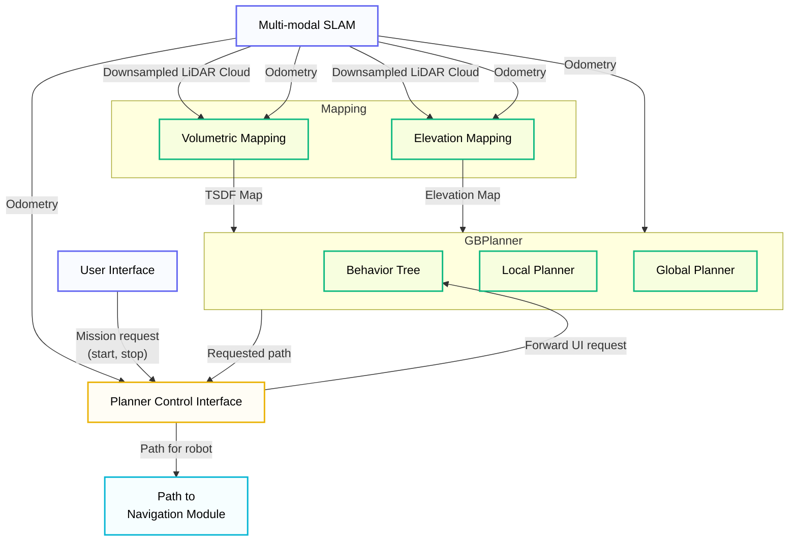

# Planning

[GBPlanner 3.0](https://github.com/ntnu-arl/gbplanner_ros/tree/gbplanner3) is the extension of our previous work on Graph-Based Exploration Planner. This release presents a set of improvements and new features:

- Improved path planning through batch sampling
- Brand new Inspection mode to inspect the mapped surfaces with a FoV constrained camera sensor
- Extended the state space of exploration and inspection to include sensor pitch

The method is fully [open-source](https://github.com/ntnu-arl/gbplanner_ros/tree/gbplanner3) and integrated into the Unified Autonomy Stack. It has been validated in both simulation and real-world experiments on aerial and ground robots.

!!! note "Source Code"
    - **Workspace:** `workspaces/ws_gbplanner/src`
    - **Package:** `gbplanner_ros`
    - **GitHub:** [ntnu-arl/gbplanner_ros](https://github.com/ntnu-arl/gbplanner_ros/tree/gbplanner3)


**Related Publications:**

- [Dharmadhikari, M., et al. "Autonomous Exploration and General Visual Inspection of Ship Ballast Water Tanks Using Aerial Robots." 2023 21st International Conference on Advanced Robotics (ICAR), pp. 409-416, 2023.](https://ieeexplore.ieee.org/document/10406928)
- [Kulkarni, M., et al. "Autonomous Teamed Exploration of Subterranean Environments using Legged and Aerial Robots." 2022 International Conference on Robotics and Automation (ICRA), pp. 3306-3313, 2022.](https://ieeexplore.ieee.org/document/9812401)
- [Dang, T., et al. "Graph-based subterranean exploration path planning using aerial and legged robots." Journal of Field Robotics, vol. 37, no. 8, pp. 1363-1388, 2020.](https://onlinelibrary.wiley.com/doi/abs/10.1002/rob.21993)


## Local Planner

The local planner operates in a subspace around the current robot location to maximize newly mapped volume. It builds a 3D graph by sampling vertices in free space and connecting them with admissible edges. Shortest paths are computed using Dijkstra's algorithm from the current robot location, and an exploration gain—reflecting the expected volume to be mapped along each path—is calculated for candidate trajectories. GBPlanner3 offers clustering of vertices for gain calculation and an option to compute gain only at leaf vertices of the shortest paths to accelerate computation. Additional ray casting optimizations further reduce computation time. The path with the highest exploration gain is selected, refined for safety, and commanded to the robot.

**Edge Admissibility:**

| Robot Type | Admissibility Criteria                                                                                                                                                                               |
| ---------- | ---------------------------------------------------------------------------------------------------------------------------------------------------------------------------------------------------- |
| **Aerial** | Edge lies entirely in free space                                                                                                                                                                     |
| **Ground** | Sampled points and interpolated edges are projected downward onto the map to verify ground presence; each segment must be collision-free and within inclination limits set by locomotion constraints |

## Global Planner

The global planner handles two tasks:

1. **Repositioning:** When local exploration is exhausted, the robot is guided to a previously identified high-gain location on the map.
2. **Return-to-home:** The robot is brought back to the home location when the mission time limit is reached or the entire bounded volume has been explored.

## Inspection Mode

In inspection mode, the planner builds a grid of viewpoints along mapped surfaces using the underlying volumetric map. These viewpoints are connected by collision-free edges to form a 3D graph; additional points are sampled if any viewpoints remain disconnected. The minimal set of viewpoints covering the entire visible mapped surface is selected, and their visitation order is determined by solving the Traveling Salesman Problem.

## Planning Architecture

The following diagram describes the entities in the Planning Module along with the data exchange within and outside the module.



The planner uses a bifurcated local and global planning architecture.

## Topics & Interfaces

The planner stack consists of two ROS nodes: **GBPlanner** and **Planner Control Interface (PCI)**.

### Services (Input)

| Service                               | Type                              | Description                                                    |
| ------------------------------------- | --------------------------------- | -------------------------------------------------------------- |
| `pci/std_srvs/automatic_planning`     | `std_srvs/Trigger`                | Trigger planner; PCI keeps triggering at end of each iteration |
| `pci/std_srvs/single_planning`        | `std_srvs/Trigger`                | Trigger single planning iteration                              |
| `pci/stop_request`                    | `std_srvs/Trigger`                | Stop planner and halt robot                                    |
| `pci/std_srvs/homing_trigger`         | `std_srvs/Trigger`                | Return to home after current iteration                         |
| `pci/std_srvs/go_to_waypoint`         | `std_srvs/Trigger`                | Plan path to waypoint along global graph                       |
| `pci_initialization_trigger`          | `planner_msgs/pci_initialization` | Trigger initialization motion                                  |
| `pci_global`                          | `planner_msgs/pci_global`         | Send robot to specific global graph vertex                     |
| `pci/std_srvs/inspection_srv_trigger` | `std_srvs/Trigger`                | Trigger inspection mode                                        |

### Subscribed Topics

#### GBPlanner

| Topic                         | Type                                      | Description                        |
| ----------------------------- | ----------------------------------------- | ---------------------------------- |
| `pose`                        | `geometry_msgs/PoseWithCovarianceStamped` | Robot pose                         |
| `pose_stamped`                | `geometry_msgs/PoseStamped`               | Robot pose (alternative)           |
| `odometry`                    | `nav_msgs/Odometry`                       | Robot odometry                     |
| `cam_pitch`                   | `sensor_msgs/JointState`                  | Actuated camera pitch angle        |
| `/robot_status`               | `planner_msgs/RobotStatus`                | Battery time remaining             |
| `/gbplanner_node/tsdf_map_in` | `voxblox_msgs/Layer`                      | External TSDF map input (optional) |
| `/gbplanner_node/esdf_map_in` | `voxblox_msgs/Layer`                      | External ESDF map input (optional) |

#### Planner Control Interface

| Topic       | Type                                      | Description                          |
| ----------- | ----------------------------------------- | ------------------------------------ |
| `pose`      | `geometry_msgs/PoseWithCovarianceStamped` | Robot pose (either pose or odom)     |
| `odometry`  | `nav_msgs/Odometry`                       | Robot odometry (either pose or odom) |
| `cam_pitch` | `sensor_msgs/JointState`                  | Actuated camera pitch angle          |

### Published Topics

#### Trajectory Output (PCI)

| Topic                | Type                                      | Description                                                |
| -------------------- | ----------------------------------------- | ---------------------------------------------------------- |
| `command/trajectory` | `trajectory_msgs/MultiDOFJointTrajectory` | Output path as a multi-dof trajectory                      |
| `/gbplanner_path`    | `nav_msgs/Path`                           | Output path as a path (Used in the unified autonomy stack) |
| `act_cam_cmd`        | `std_msgs/Float64`                        | Actuated camera pitch command                              |

#### Map & Visualization (GBPlanner)

| Topic                                | Type                             | Description                   |
| ------------------------------------ | -------------------------------- | ----------------------------- |
| `/gbplanner_node/mesh`               | `voxblox_msgs/Mesh`              | Voxblox mesh                  |
| `/gbplanner_node/tsdf_map_out`       | `voxblox_msgs/Layer`             | TSDF map output               |
| `/gbplanner_node/esdf_map_out`       | `voxblox_msgs/Layer`             | ESDF map output               |
| `/gbplanner_node/surface_pointcloud` | `sensor_msgs/PointCloud2`        | Surface point cloud           |
| `vis/*`                              | `visualization_msgs/MarkerArray` | Planner visualization markers |

## Configuration

Parameters are set in `robot_bringup/config/gbplanner/<mission_name>/gbplanner_config.yaml`.

### Behavior Tree

- `behavior_tree_path`: Path to mission behavior tree XML file
  - `lge_homing.xml`: Exploration with homing when complete or time limit reached
  - `lge_insp.xml`: Exploration followed by surface inspection
  - `lnav`: Navigate to a waypoint in unknown space

### Graph Building

| Parameter                            | Description                                                                          |
| ------------------------------------ | ------------------------------------------------------------------------------------ |
| `PlanningParams/graph_building_mode` | `kBasic` (default) or `kBatch` sampling                                              |
| `PlanningParams/num_vertices_max`    | Maximum graph vertices                                                               |
| `PlanningParams/num_edges_max`       | Maximum graph edges                                                                  |
| `PlanningParams/edge_length_min/max` | Edge length bounds (m)                                                               |
| `PlanningParams/nearest_range`       | Vertex connection range (m)                                                          |
| `PlanningParams/box_check_method`    | Collision check: `0`=voxel grid, `1`=sphere approx, `2`=SDF grid                     |
| `PlanningParams/line_check_method`   | Edge check: `0`=interpolated, `1`=cuboid around edge (default), `2`/`3`=SDF variants |

### Robot Geometry

| Parameter                        | Description                                              |
| -------------------------------- | -------------------------------------------------------- |
| `RobotParams/type`               | `kAerialRobot` or `kGroundRobot`                         |
| `RobotParams/size`               | Robot dimensions `[x, y, z]` (m)                         |
| `RobotParams/size_extension`     | Default collision margin `[x, y, z]` (m)                 |
| `RobotParams/size_extension_min` | Minimum collision margin `[x, y, z]` (m)                 |
| `RobotParams/center_offset`      | Offset from cuboid center to odometry frame `[x, y, z]`  |
| `RobotParams/bound_mode`         | `0`=extended, `1`=relaxed, `2`=min, `3`=exact, `4`=point |
| `RobotParams/safety_extension`   | Freespace corridor dimensions for path safety            |

### Ground Robot Specific

| Parameter                          | Description                           |
| ---------------------------------- | ------------------------------------- |
| `PlanningParams/max_ground_height` | Target height above ground (m)        |
| `PlanningParams/robot_height`      | Odometry frame height from ground (m) |
| `PlanningParams/max_inclination`   | Maximum traversable slope (rad)       |

### Exploration Bounds

| Parameter                               | Description                                          |
| --------------------------------------- | ---------------------------------------------------- |
| `BoundedSpaceParams/Global/type`        | `kCuboid` or `kSphere`                               |
| `BoundedSpaceParams/Global/min_val`     | Lower bound `[x, y, z]` (cuboid)                     |
| `BoundedSpaceParams/Global/max_val`     | Upper bound `[x, y, z]` (cuboid)                     |
| `BoundedSpaceParams/Local/*`            | Local sampling space (for `kBasicExploration`)       |
| `BoundedSpaceParams/LocalAdaptiveExp/*` | Adaptive sampling space (for `kAdaptiveExploration`) |

### Sensor Model

| Parameter                           | Description                               |
| ----------------------------------- | ----------------------------------------- |
| `SensorParams/sensor_list`          | List of sensor names                      |
| `SensorParams/<name>/type`          | `kLidar` or `kCamera`                     |
| `SensorParams/<name>/max_range`     | Sensor range (m)                          |
| `SensorParams/<name>/fov`           | Field of view `[h, v]` (rad)              |
| `SensorParams/<name>/resolution`    | Ray-cast resolution `[h, v]` (rad)        |
| `SensorParams/<name>/center_offset` | Sensor offset from odometry `[x, y, z]`   |
| `SensorParams/<name>/rotations`     | Sensor orientation `[roll, pitch, yaw]`   |
| `SensorParams/<name>/rot_lims`      | Actuated camera limits `[min, max]` (rad) |

### Exploration Gain

| Parameter                                       | Description                               |
| ----------------------------------------------- | ----------------------------------------- |
| `PlanningParams/exp_sensor_list`                | Sensors for gain calculation              |
| `PlanningParams/free_voxel_gain`                | Weight for free voxels                    |
| `PlanningParams/occupied_voxel_gain`            | Weight for occupied voxels                |
| `PlanningParams/unknown_voxel_gain`             | Weight for unknown voxels                 |
| `PlanningParams/path_length_penalty`            | Path length cost weight                   |
| `PlanningParams/leafs_only_for_volumetric_gain` | Evaluate gain at leaf vertices only       |
| `PlanningParams/cluster_vertices_for_gain`      | Cluster vertices for gain calculation     |
| `PlanningParams/nonuniform_ray_cast`            | Increase ray-cast step size with distance |

### Path Extraction

| Parameter                                    | Description                     |
| -------------------------------------------- | ------------------------------- |
| `PlanningParams/traverse_length_max`         | Maximum path length (m)         |
| `PlanningParams/traverse_time_max`           | Maximum path execution time (s) |
| `PlanningParams/path_safety_enhance_enable`  | Improve path safety             |
| `PlanningParams/path_interpolation_distance` | Path interpolation step (m)     |

### Global Planner

| Parameter                                   | Description                                 |
| ------------------------------------------- | ------------------------------------------- |
| `PlanningParams/auto_global_planner_enable` | Trigger global planner when local exhausted |
| `PlanningParams/go_home_if_fully_explored`  | Return home if no frontiers remain          |
| `PlanningParams/time_budget_limit`          | Mission time limit (s)                      |

### Inspection

| Parameter                                        | Description                       |
| ------------------------------------------------ | --------------------------------- |
| `PlanningParams/min_coverage_percentage`         | Target surface coverage fraction  |
| `PlanningParams/inspection_xy_spacing`           | Viewpoint grid resolution XY (m)  |
| `PlanningParams/inspection_z_spacing`            | Viewpoint grid resolution Z (m)   |
| `PlanningParams/inspection_target_viewing_range` | Viewpoint projection distance (m) |
| `PlanningParams/max_inspection_vertices`         | Maximum viewpoints in path        |
| `PlanningParams/num_lkh_iterations`              | TSP solver iterations             |

### Mapping (Voxblox)

Set in `config/<robot_name>/voxblox_config.yaml`:

| Parameter             | Description                       |
| --------------------- | --------------------------------- |
| `world_frame`         | Fixed frame for planning          |
| `tsdf_voxel_size`     | Voxel size (m)                    |
| `truncation_distance` | TSDF truncation (2–5× voxel size) |
| `max_ray_length_m`    | Maximum ray-cast distance (m)     |

### Planner Control Interface

Set in `config/<robot_name>/planner_control_interface_sim_config.yaml`:

| Parameter                    | Description                              |
| ---------------------------- | ---------------------------------------- |
| `robot_type`                 | `kAerial` or `kGround`                   |
| `init_motion_enable`         | Perform initialization motion on start   |
| `smooth_heading_enable`      | Limit heading rate to achievable values  |
| `interpolate_traj`           | Interpolate trajectory in time           |
| `RobotDynamics/v_max`        | Maximum linear velocity (m/s)            |
| `RobotDynamics/v_homing_max` | Maximum homing velocity (m/s)            |
| `RobotDynamics/yaw_rate_max` | Maximum yaw rate (rad/s)                 |
| `RobotDynamics/a_max`        | Acceleration for velocity profile (m/s²) |
| `RobotDynamics/dt`           | Trajectory interpolation step (s)        |

---

## Citation

If you use this method in your work, please cite the relevant publications:

```bibtex
@inproceedings{planning_gvi,
	title = {Autonomous {Exploration} and {General} {Visual} {Inspection} of {Ship} {Ballast} {Water} {Tanks} {Using} {Aerial} {Robots}},
	url = {https://ieeexplore.ieee.org/document/10406928},
	doi = {10.1109/ICAR58858.2023.10406928},
	booktitle = {2023 21st {International} {Conference} on {Advanced} {Robotics} ({ICAR})},
	author = {Dharmadhikari, Mihir and De Petris, Paolo and Kulkarni, Mihir and Khedekar, Nikhil and Nguyen, Huan and Stene, Arnt Erik and Sjøvold, Eivind and Solheim, Kristian and Gussiaas, Bente and Alexis, Kostas},
	month = dec,
	year = {2023},
	note = {ISSN: 2572-6919},
	keywords = {Electronic ballasts, Geometry, Inspection, Robot vision systems, Storage management, Visualization, Water},
	pages = {409--416},
}

@inproceedings{planning_gbplanner2,
	title = {Autonomous {Teamed} {Exploration} of {Subterranean} {Environments} using {Legged} and {Aerial} {Robots}},
	url = {https://ieeexplore.ieee.org/document/9812401},
	doi = {10.1109/ICRA46639.2022.9812401},
	booktitle = {2022 {International} {Conference} on {Robotics} and {Automation} ({ICRA})},
	author = {Kulkarni, Mihir and Dharmadhikari, Mihir and Tranzatto, Marco and Zimmermann, Samuel and Reijgwart, Victor and De Petris, Paolo and Nguyen, Huan and Khedekar, Nikhil and Papachristos, Christos and Ott, Lionel and Siegwart, Roland and Hutter, Marco and Alexis, Kostas},
	month = may,
	year = {2022},
	keywords = {Legged locomotion, Navigation, Network topology, Robot kinematics, Space missions, Three-dimensional displays, Wireless communication},
	pages = {3306--3313},
}

@article{planning_gbplanner1,
	title = {Graph-based subterranean exploration path planning using aerial and legged robots},
	volume = {37},
	copyright = {© 2020 Wiley Periodicals LLC},
	issn = {1556-4967},
	url = {https://onlinelibrary.wiley.com/doi/abs/10.1002/rob.21993},
	doi = {10.1002/rob.21993},
	number = {8},
	urldate = {2025-11-30},
	journal = {Journal of Field Robotics},
	author = {Dang, Tung and Tranzatto, Marco and Khattak, Shehryar and Mascarich, Frank and Alexis, Kostas and Hutter, Marco},
	year = {2020},
	note = {\_eprint: https://onlinelibrary.wiley.com/doi/pdf/10.1002/rob.21993},
	keywords = {aerial robots, legged robots, path planning, subterranean robotics},
	pages = {1363--1388},
}
```
