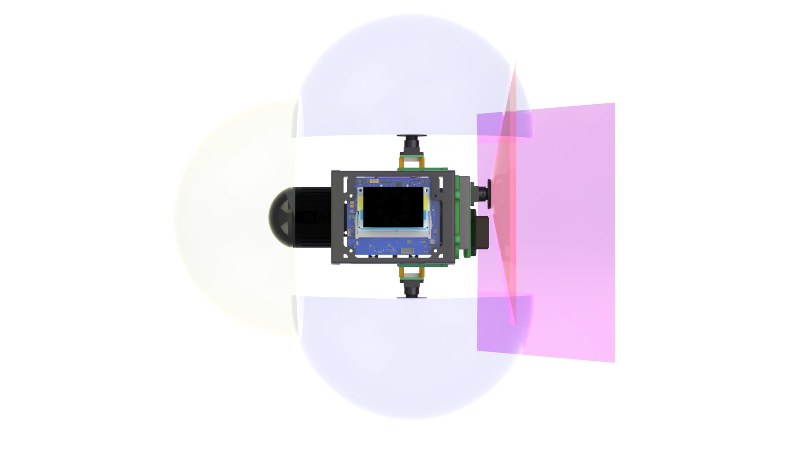

## Fully integrated platforms 

### UniPilot

UniPilot is a compact, plug-and-play hardware-software autonomy payload designed for integration across diverse robot embodiments including aerial and ground platforms. It features a multi-modal sensing suite (LiDAR, radar, vision, ToF, IMU) and an NVIDIA Jetson Orin NX compute board running complete autonomy software for SLAM, path planning, and learning-based navigation. The lightweight design enables robust autonomous operation in GPS-denied environments across multirotors, legged robots, and hybrid VTOL platforms. 

<div class="grid" markdown>

</div>

Sensor FoV Visualization:

<div class="grid" markdown>
{ width="230" }
{ width="230" }
{ width="230" }
</div>


## Multirotors


The complete Unified Autonomy Stack has been integrated and tested on a collision-tolerant multirotor platform equipped with the UniPilot payload.

## Legged Robots


The Unified Autonomy Stack has been integrated with the ANYmal D quadruped robot via the UniPilot payload, enabling robust autonomous perception, planning and navigation in GPS-denied environments using the full Unified Autonomy Stack.


## Handheld Unit


The UniPilot payload running the Unified Autonomy Stack has been integrated as a handheld unit for rapid data collection across environments.


## Partial Integration

### Hybrid VTOL - x-Wing


The Unified Autonomy Stack has now been integrated with the x-Wing hybrid VTOL platform. The UniPilot payload provides the necessary sensing and compute capabilities to enable autonomous navigation in GNSS-denied environments.

### Underwater Platform - Blue ROV


The Unified Autonomy Stack has been partially integrated with the Blue ROV underwater platform, planning and inspection capabilities underwater.

---

## Citation

If you use the Unified Autonomy Stack or the UniPilot reference hardware platform in your research, please cite the following publications:

```bibtex
@article{unipilot,
  title={UniPilot: Enabling GPS-Denied Autonomy Across Embodiments},
  author={Kulkarni, Mihir and Dharmadhikari, Mihir and Khedekar, Nikhil and Nissov, Morten and Singh, Mohit and Weiss, Philipp and Alexis, Kostas},
  journal={arXiv preprint arXiv:2509.11793},
  year={2025}
}
```