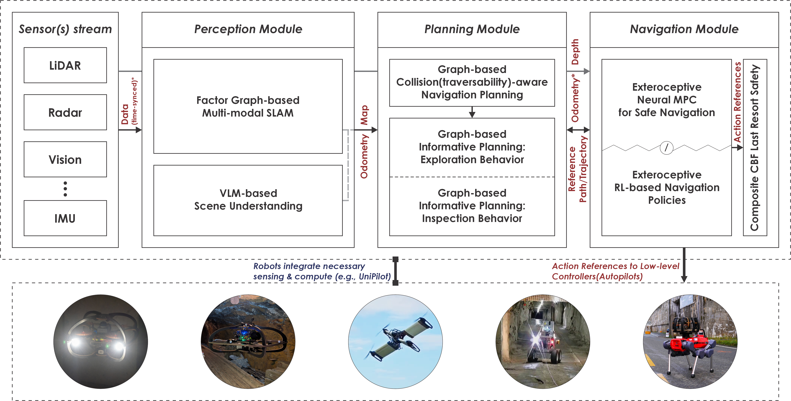
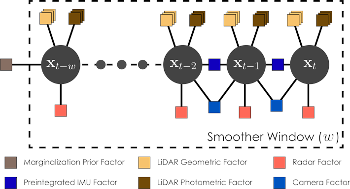
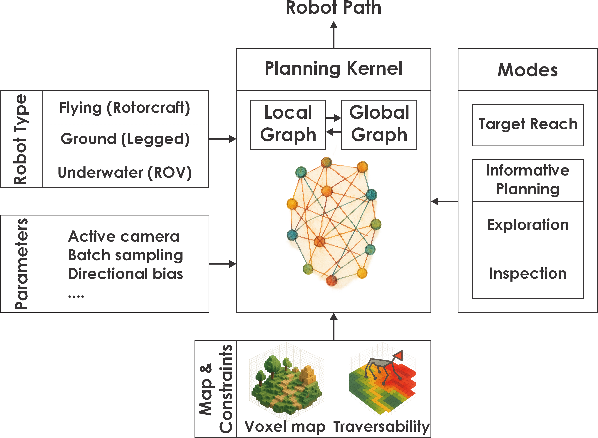

# The Unified Autonomy Stack: Toward a Blueprint for Generalizable Robot Autonomy

**Autonomous Robots Lab**, Norwegian University of Science and Technology, Norway

---

## Abstract
We introduce and open-source the `Unified Autonomy Stack`, a system-level solution that enables robust autonomy across a wide range of aerial and ground robot morphologies. The architecture centers on three broadly applicable modules -multi-modal perception, multi-stage planning, and multi-layered safety mechanisms- that together deliver end-to-end mission autonomy. The resulting behaviors include safe navigation into unknown regions, exploration of complex environments, efficient inspection planning, and object-level scene reasoning. The stack has been validated on multiple multirotor platforms and legged robots operating in GPS-denied and perceptually degraded environments (e.g., self-similar, textureless, smoke/dust-filled settings), demonstrating resilient performance in demanding conditions. It currently supports two major embodiment families, namely rotorcraft and certain ground systems such as legged and differential-drive platforms, while several of its modules have already been validated on additional robot types, including fixed-wing aircraft for GPS-denied flight and underwater exploration planning. To facilitate ease of adoption and extension, we additionally release a reference hardware design that integrates a full multi-modal sensing suite, time-synchronization electronics, and high-performance compute capable of running the entire stack while leaving headroom for further development. Strategically, we aim to expand the Unified Autonomy Stack to cover most robot configurations across air, land, and sea.

---

## 1. Introduction

Autonomy is conventionally designed in a manner bespoke to distinct robot classes. Despite some generalizability in certain subsystems of autonomy, existing literature and available autonomy stacks (e.g., the works in [1, 2, 3, 4, 5, 6, 7, 8]) do not emphasize a unified solution across diverse robot configurations. However, recent advances point toward the potential for a universal autonomy engine. Despite the fact that such a goal is still immature and a wide range of approaches are worth investigating - spanning from ``conventional'' strategies to fully data-driven techniques - the benefits of unification and the collective need to advance robot capabilities highlight the need for general autonomy solutions.

*Figure 1: We release the `Unified Autonomy Stack` aiming for a common blueprint across diverse robot configurations. Currently supporting widely adopted aerial and ground robot types, the stack is planned to cover different robot morphologies across air, land, and sea. Several of its submodules have been tested across the three operational domains.*

Motivated by the above, we present the `Unified Autonomy Stack`, a comprehensive open-source autonomy stack applicable across diverse air and ground robot configurations. The `Unified Autonomy Stack` represents a step towards a common autonomy blueprint across diverse robot types - from multirotors and other rotorcrafts to legged robots - with the goal to push the frontier toward universal approaches in embodied AI. Its design emphasizes resilience in that it presents robustness, resourcefulness, and redundancy, enabling it to retain high performance across environments and conditions, including GPS-denied, visually-degraded, geometrically complex, and potentially adversarial settings that typically challenge safe navigation and mission autonomy.

At its core, the `Unified Autonomy Stack` enables navigation for diverse systems in GPS-denied conditions. Simultaneously, it currently offers mission-complete capabilities for a set of information-gathering tasks such as autonomous exploration and inspection. Importantly, the `Unified Autonomy Stack` is open for extension, both from the perspective of the robots it readily supports and the missions it enables. Our team is explicitly targeting its full-fledged expansion to a) fixed-wing aerial robots, and b) small-scale underwater robots, while facilitating enhanced object-guided behaviors. Developed over a decade of research with its modules (independently or collectively) verified across a great variety of environments and missions spanning from subterranean spaces such as caves and mines - especially in the DAPRA Subterranean Challenge (planner module and a previous version of our perception stack [9, 10, 11]) - to ship ballast tanks and offshore facilities [12], industrial facilities [13], urban facilities [14, 15], and dense forests [16], the presented stack brings high technology readiness while simultaneously facilitating open research investigations.

## 2. Unified Autonomy

This section presents the architecture and key modules of the unified autonomy stack.

### 2.1 Autonomy Architecture

*Figure 2. The architecture of the Unified Autonomy Stack.*

The `Unified Autonomy Stack` is organized around three core modules - `perception`, `planning`, and `navigation` - following the key principles of the "sense-think-act" loop, while targeting generalizability across aerial and ground robot configurations, and resilience in demanding environments. Its overall architecture is presented in Figure 2. As shown, the `Unified Autonomy Stack` consumes sensor data and outputs low-level commands to standard controllers available in most modern robotic systems, for example on Pixhawk/PX4-based drones [17] (or any other MAVLink-compatible autopilot [18]) and standard velocity controllers on ground platforms. Its key features are as follows:

* **Generalizability:** The `Unified Autonomy Stack` applies with few adjustments to particularly diverse robot configurations, offering identical user-experience for navigation and informative path planning tasks despite system differences. Currently supporting out-of-the-box multirotors and other rotorcrafts, alongside several ground systems and especially legged robots, while many of its sub-modules have been verified on a broader set of systems including fixed-wing aircraft and underwater robots, it represents a sound point of departure for research in unified embodied AI.
* **Multi-modality:** The `Unified Autonomy Stack` fuses complementary sensor cues currently including LiDAR, FMCW radar, vision, and IMU in order to enable resilience in perceptually-degraded GPS-denied conditions [20].
* **Multi-layer Safety:** The `Unified Autonomy Stack` departs from conventional architectures in which safety is ensured by solutions with a single-point-of-failure. Most commonly, modern autonomy solutions rely on a cascade of calculations in which collision-free planning takes place only on an online (or offline) reconstructed map. In practice, this means that non-trivial localization or mapping errors (often encountered in perceptually-degraded settings or with thin obstacles) can lead to collisions. The `Unified Autonomy Stack` implements multiple layers of safety by combining map-based collision-free motion planning with a set of navigation policies and safety filters that directly consume online exteroception data and if necessary adjust the robot's path to correct for safety.
* **Hybrid Methods:** The `Unified Autonomy Stack` integrates both "conventional" techniques and deep learning methods. Indicative examples include its factor graph-based multi-modal Simultaneous Localizalition And Mapping (SLAM) and its navigation policies offering options for Exteroceptive Deep Reinforcement Learning (DRL)-based and Neural Signed Distance Field (SDF)-based Nonlinear Model Predictive Control (Neural SDF-NMPC).

Subsequently, we outline the key modules of the `Unified Autonomy Stack` and point to prior works as applicable. Furthermore, we discuss the interfaces considered and how the `Unified Autonomy Stack` can be extended to new robot configurations.

### 2.2 Perception Module

The `perception module` includes our solution for multi-modal SLAM, alongside integration with a VLM-based reasoning step.

#### 2.2.1 Multi-Modal SLAM
The multi-modal SLAM (dubbed MIMOSA) system (depicted in Figure 3) uses a factor graph estimator to fuse LiDAR, radar, camera, and IMU measurements using a windowed smoother [19], for computational efficiency. This architecture, as shown in the referenced figures, is based on the methods proposed in [20, 21, 22, 23] for enhanced LiDAR and radar integration. The estimator considers a state space comprised of position, velocity, attitude, accelerometer/gyroscope bias, and gravity direction states. These are estimated over a temporal window by a nonlinear optimizer [24], where the optimal estimate $\mathcal{X}^{*}$ is found by minimizing the weighted (by their covariances $\Sigma_{*}$) sum of the residuals $\boldsymbol{e}_{*}$ derived from the different sensor measurements. This minimization problem can thus be written as follows:

$$
\mathcal{X}^{*} = \underset{\mathcal{X}}{\arg\min} \Big[ 
        \lVert \boldsymbol{e}_{0} \rVert_{\Sigma_{0}}^{2}
        + \sum_{i\in\mathcal{F}_{\mathcal{I}}} \lVert \boldsymbol{e}_{\mathcal{I}_{i}} \rVert_{\Sigma_{\mathcal{I}}}^{2}
        + \sum_{i\in\mathcal{F}_{\mathcal{L}}} \lVert \boldsymbol{e}_{\mathcal{L}_{i}} \rVert_{\Sigma_{\mathcal{L}}}^{2}
        + \sum_{i\in\mathcal{F}_{\mathcal{R}}} \lVert \boldsymbol{e}_{\mathcal{R}_{i}} \rVert_{\Sigma_{\mathcal{R}}}^{2}
        + \sum_{i\in\mathcal{F}_{\mathcal{V}}} \lVert \boldsymbol{e}_{\mathcal{V}_{i}} \rVert_{\Sigma_{\mathcal{V}}}^{2}
    \Big],
$$

for the marginalization prior $\boldsymbol{e}_{0}$,$\Sigma_{0}$, and the IMU, LiDAR, radar, and vision factors $\mathcal{F}_{*}$ in the window time frame (denoted by $\mathcal{I}$, $\mathcal{L}$, $\mathcal{R}$, and $\mathcal{V}$, respectively). The details on how sensor measurements are used to construct each of these factors are provided in the following sections.

*Figure 3. Overarching factor graph of our MIMOSA Multi-modal.*

**Inertial Measurement Unit**
Inertial Measurement Unit (IMU) measurements are stored in a buffer on arrival, for easy use upon receiving measurements from one of the aiding sensors. At that point, the corresponding exteroceptive factors are created and connected to the graph by an IMU preintegration factor, following [25]. Note that, given the multiple exteroceptive sensors and the possibility of transmission latency, a node in the graph with the same or very similar timestamp may already exist at this point. If this is the case, the new factors are attached to the existing node.

**LiDAR**
Upon receiving a LiDAR measurement, the point cloud is first deskewed, using the IMU measurements corresponding to the LiDAR's sweep. Afterwards, the point cloud is downsampled, for computational efficiency, first by removing three out of four points, and second by organizing the point cloud into a voxel grid and subsampling. Subsequently, the correspondences are found by relating points in the current cloud with planes so as to fit in the map; these correspondences are added to the graph in the form of point-to-plane residuals. For outlier rejection, these residuals are augmented with Huber M-estimators. Post-optimization, the pose is compared with previous key frames, and if a significant difference in position or attitude is detected, a new key frame is created, and the current point cloud is added to the monolithic map. The core method is presented in [22].

**Radar**
Unlike the estimator proposed in [21], here the least-squares calculation of linear velocity from the radar point cloud is omitted. Instead, the individual points from the radar point cloud are integrated into the graph. This avoids the potential limitations associated with first estimating linear velocity independently. Namely, these are the minimum number and diversity of points required for fully resolving the 3 axes of linear velocity. As the radar sensor is known to be noisy [26], the residual is augmented with a Cauchy M-estimator for outlier rejection. This has the added benefit of improved resilience against dynamic objects.

**Vision**
Vision factors are added in a loosely-coupled manner, taking advantage of the wealth of capable estimators that exist in the vision community. Specifically, a visual-inertial estimator based on [27] processes the camera and IMU measurements, creating odometry estimates as a result. The pose estimates from this fusion are stored in a buffer and added to the graph of our multi-modal SLAM as a between factor by calculating the relative transform between two pose estimates. This approach draws inspiration from [20].

#### 2.2.2 Vision-Language Reasoning

The system currently integrates two complementary vision-language model (VLM) modalities: (a) open-vocabulary object detection with 3D spatial grounding, and (b) binary visual question-answering (Yes/No) with reasoning. In their combination, these capabilities collectively enable semantic scene understanding and contextual judgment based on online visual data.

**Open-Vocabulary Object Detection with 3D Projection**
Object detection is performed using either a prompt-free detector (YOLOe) or a VLM-based detector (GPT-4V) initialized with a set of labels. These models operate on the front-camera image and produce 2D bounding boxes. In parallel, a downsampled voxel grid derived from the LiDAR point cloud and our MIMOSA SLAM odometry estimate is maintained. Accordingly, LiDAR points are projected into the camera frame using the current pose estimate (and the relevant extrinsics), and clustered to identify which points fall within each 2D detection. This produces aligned 2D detections and corresponding 3D bounding volumes.

**Yes/No VLM Question Answering**
For high-level semantic assessment, a VLM (currently GPT-4V) processes the front-camera image together with a ``Yes/No'' question. Indicative queries relate to assessing safety- or navigation-related properties of the scene (e.g., is an object blocking a door?). The model returns the binary answer, alongside a color-coded confidence overlay, and a brief explanation of the reasoning.

### 2.3 Planning Module

Path planning in the `Unified Autonomy Stack` is facilitated through an updated and extended version of the graph-based planner GBPlanner (called GBPlanner3) originally presented in [10, 11] and augmented for coverage behaviors in [12]. Currently applicable to systems for which graph-based planning is a viable choice, the system enables both target navigation as well as informative planning behaviors such as exploration and inspection in a unified approach (Figure 4).

*Figure 4. Planning module architecture.*

#### 2.3.1 Core Planning Strategy
GBPlanner's core principles rely on random sampling-based graphs and a local/global architecture that facilitates scalable operation across environments of vast scale and complex geometries. The method samples a dense local graph around the robot's location at any given time, while it simultaneously maintains a sparse global graph that spans over all the regions the robot has visited up to any point in its mission. Graph vertices and edges are sampled only in a collision-free manner, exploiting the volumetric representation in Voxblox [28]. LiDAR or any other depth data is used to update Voxblox online. On top of this planning kernel, the system facilitates collision-free path planning to desired targets, as well as informative behaviors such as exploration of unknown environments and inspection planning. Specifically for ground robots, the method further incorporates traversability constraints, building upon the representation in [29]. A set of other modifications as compared to the prior works in [10, 11, 12] improve the overall behavior, including but not limited to batch vertex-edge sampling in the local graph, availability of multiple distributions (uniform and normal tailored to narrow spaces) for vertex sampling, and active collision re-check and path modification during global re-positioning and return-to-home plans.

#### 2.3.2 Collision-free Planning to a Target
The `Unified Autonomy Stack` facilitates planning to a desired waypoint both within the already explored space, as well as in the unknown, as long as this is iteratively found to be possible. For the first goal, the method simply exploits its local and global graphs to plan a safe path to any of the explored locations. For the latter, the method plans to a waypoint close to the frontier of the explored volume and in the direction of the desired target, while it then iteratively repeats this process as the robot unveils more of the space based on its onboard depth sensing.

#### 2.3.3 Exploration Planning
When the behavior exploration of unknown volumes is set, the planner is searching within its local graph for paths that maximize the anticipated gain of new volume to be explored, considering a defined range sensor model, as detailed in [10, 11]. When the solutions within the local graph report that no such informative path exists, the method re-positions the robot to a previously explored area in order for the exploration mission to be effectively continued. If the considered robot endurance limits are about to be reached, the method timely commands a return-to-home path for the system (considering the time it takes to return to that location).

#### 2.3.4 Inspection Planning
When the behavior of optimized inspection of previously mapped structures is set, the planner is using its random graph to search for a route that observes as much as possible of the considered subset of the environment while keeping the collective path length small. The method assumes a certain sensor frustum for inspection that may be distinct from the sensor with which the robot explores the world volumetrically. Inspection resolution and angle guarantees are provided and the overall methodology is inspired by the concept of General Visual Inspection (GVI) in industrial facilities. The procedure is detailed in [12]. Critically, the exploration and inspection behaviors can be combined with the planner triggering each mode as necessary for a broader mission.

### 2.4 Navigation Module

The `Unified Autonomy Stack` takes a multi-layered approach to safety illustrated in Figure 5. Conventionally, modern safe navigation and collision avoidance are based on the planning of paths (and trajectories) which are then blindly followed by an onboard controller. However, as discussed in [16, 30], this represents a single point of failure which can lead robots to collisions due to odometry errors or erroneous/incomplete mapping. While the `Unified Autonomy Stack` maintains map-based avoidance as the core approach to safety, it adds layers of safety either through (a) the combined use of exteroceptive Neural SDF-NMPC [16] and last-resort safety filtering based on CBFs, or (b) via exteroceptive DRL-based policies trained for safe navigation and smooth collision avoidance. The two distinct approaches -presented below- are offered simultaneously for the user to select owing to their relative benefits in certain conditions and in order to enable research across areas. These methods replace conventional position controllers - or similar methods - that assume that the provided path planned on the reconstructed map is to be followed blindly, and instead enable local deviations if necessary. They provide commands to a low-level controller following standard interfaces applicable across most widely used Autopilots and Robot Operating System (ROS)-based ground vehicles or similar systems. 

*Figure 5. Navigation module architecture Note that currently Neural SDF-NMPC provides acceleration references potentially adjusted by the Composite CBF safety filter, while when Exteroceptive-DRL is utilized the output is velocity references and integration with the safety filter is not currently provided.*

#### 2.4.1 Neural SDF-NMPC
Detailed in [16], the Neural SDF-NMPC enables collision-free navigation in unknown environments even without access to a map, errors in a robot's map or drifting odometry. The method employs onboard range sensing (e.g., from a LiDAR or depth from stereo/RGB-D) and a deep neural network to convert range images to a SDF representation through a cascade structure. First, a convolutional encoder compresses the input image and then a Multi-Layer Perceptron (MLP) approximates the SDF. The learned SDF is then providing explicit position constraints for obstacle avoidance, directly into a nonlinear MPC. Thus, the method outputs acceleration commands to be tracked by a low-level control and enables safer navigation to target locations by adding a further layer of safety. Critically, the Neural SDF-NMPC provides theoretical guarantees when it comes to recursive feasibility and stability (under fixed sensor observations), which are essential features for the emphasis `Unified Autonomy Stack` puts on assured safety. Note that the method specifically tracks reference velocities and thus the interface with the `planning module` employs a function to produce such commands from planned paths.

#### 2.4.2 Deep Reinforcement Learning
Alternatively to the use of the Neural SDF-NMPC, the `Unified Autonomy Stack` further offers exteroceptive DRL-based navigation (dubbed Exteroceptive-DRL) based on the work in [30, 31]. The provided policies consider as input both the robot's odometry and the instantaneous real-time depth (or range) image from any relevant sensor (including stereo or RGB-D cameras, as well as LiDARs). We offer the option to both train the policy by (a) first employing the DCE originally presented in [32] and thus encode the depth image to a low-dimension latent space responsible to maintain collision information, or (b) directly employ end-to-end learning from depth and odometry data to robot commands. In both cases, the command vector is the robot's reference body velocities. Like in the case of the Neural SDF-NMPC the method enables safe collision-free navigation even without a map and is thus provided under the concept of multi-layered safety, offering further assurance even when the onboard SLAM experiences odometry drift or the map fails to appropriately map certain obstacles (e.g., thin wires [33]).

#### 2.4.3 Composite CBF-based Safety Filter
Beyond the abovementioned navigation approaches -which combine map-based safety of the `planning module` with reactive collision avoidance- the `Unified Autonomy Stack` further provides a last-resort safety filter. Based on Composite Control Barrier Functions (C-CBFs) on a short sliding window of volumetric map data as detailed in [34], the solution modifies the reference acceleration (or velocity) transmitted to the robot's low-level controller when an unexpected impending collision is detected. To that point, the robot motion model is taken into consideration, while the individual obstacle constraints acquired by the map representation are combined into a composite function. The latter creates a smooth under-approximation of the safe set, and its gradient creates a "virtual obstacle" effect, acting as a weighted average of nearby obstacles to steer the robot away from danger. Although by-design considered for extremely rare engagement by the overall autonomy stack (as avoidance through planning and the presented navigation methods is made to function successfully), it is an important module to fully -and mathematically formally- safeguard autonomous robots operating in hard-to-access and overall demanding environments. Furthermore, a key decision variable for its use is the fact that both Neural SDF-NMPC and Exteroceptive-DRL involve a deep neural network the assured and explainable performance of which is not strictly guaranteed.

#### 2.4.4 Exteroceptive Overwrite
When map-based safety from the `planning module` is considered sufficient or when the specific exteroceptive navigation methods are not thought to be desirable for (or compatible with) a certain robot, the `Unified Autonomy Stack` allows to use a more conventional state feedback controller by the user. This can be any such solution, such as Linear MPC, the underlying MPC method in Neural SDF-NMPC disabling collision constraints, or a solution for any other particular robot or through any autopilot (e.g., PX4). A common option can be the use of PX4's position control mode or a standard waypoint controller provided by the robot's manufacturer or through existing open-source packages.

### 2.5 Assumed Low-level Interfaces

The `Unified Autonomy Stack` interfaces diverse aerial and ground robots through the following interfaces:
* If the multi-layered safe navigation is not necessary, we provide waypoints or 3D accelerations to existing autopilots and low-level controllers to diverse rotorcrafts and ground robots. Waypoints are straightforward for all systems that have such control. However, it does not deliver the full stack functionality of multi-layered safe navigation.
* When the full stack with multi-layered safety is considered, we command reference accelerations or velocities. Those we can provide directly to compatible autopilots and low-level controllers such as any PX4/ArduPilot-based drone.

We plan to provide support for most widely-adopted low-level control/autopilot interfaces.

## 3. Hardware

To support early adoption, we combine the open-source release of the `Unified Autonomy Stack` with a reference hardware design incorporating all the considered sensing modalities, time-synchronization electronics and ample onboard compute. Called "UniPilot" the system is detailed in [35]. UniPilot is a compact modular autonomy payload combining LiDAR, radar, vision, Time-of-Flight (ToF)-depth and IMU sensing with an NVIDIA Orin NX-based compute and is deployable across heterogeneous robots. The specific sensor types are shown in the table below. Power, interfacing and synchronization electronics enable a compact and high-performance solution. All subsystems are housed in a lightweight SLA-printed enclosure engineered for mechanical robustness and cross-platform mounting. Tested onboard multitors, legged robots, and VTOL convertible aerial robots, UniPilot represents a practical, fully integrated autonomy payload enabling mapping, planning, safety, and control across diverse platforms in challenging GPS-denied visually-degraded, communications-denied environments. It can readily run the `Unified Autonomy Stack` and thus enable its immediate adoption. The full sensing configuration (and optional choices) of UniPilot are shown in the table below.

### Components Mounted on the UniPilot Module

| Category    | Name                                  | Weight [g] | Power [W] | Description                                                                                                     |
| :---------- | :------------------------------------ | :--------- | :-------- | :-------------------------------------------------------------------------------------------------------------- |
| **Compute** | 1x Orin NX                            | 28         | 25        | RAM: 16 GB, 8-core Arm Cortex CPU, 1024-core NVIDIA GPU                                                         |
|             | 1x Boson-22 carrier board + heat sink | 152        | 13.8      | 4x MIPI CSI-2, 2x Gigabit Ethernet, 1x USB 2.0, 1x USB 3.1, 8x GPIO, 1x CAN, 2x I2C, 3x UART, 2x SPI interfaces |
| **IMU**     | 1x VectorNav VN-100                   | 15         | 0.22      | 800 Hz, Accel.: $140 \mu g/\sqrt{Hz}$, Gyro.: $0.0035^{\circ}/s/\sqrt{Hz}$                                      |
| **Cameras** | 2x VC MIPI IMX296M                    | 4          | 0.759     | Grayscale, Resolution: $1440\times1080$, FoV: $185^{\circ}$                                                     |
|             | 1x VC MIPI IMX296C                    | 4          | 0.759     | Color, Resolution: $1440\times1080$, FoV: $118^{\circ}\times94^{\circ}$                                         |
|             | 1x PMD Flexx2 ToF                     | 13         | 0.68      | Range: 4 m, FoV: $56 \times 44^{\circ}$                                                                         |
| **Radar**   | 1x D3 Embedded RS-6843AOPU            | 25         | 7.5       | Range: 49 m, FoV: $180 \times 180^{\circ}$                                                                      |
| **LiDAR**   | 1x RoboSense Airy or OUSTER OS0       | 230        | 8         | Range: 30 m, FoV: $360 \times 90^{\circ}$                                                                       |

The animation below presents the UniPilot core subsystems.

*Figure 6. 3D view of the UniPilot reference hardware design.*

## 4. Validation Results

A set of prior results (documented in the linked publications and this [YouTube List](https://youtube.com/playlist?list=PLu70ME0whad-QOtLW7t3qoU35-Yba8NmC&si=qbFSqxXjuFBPGSQU)) demonstrate the individual evaluation of the underlying modules, while a set of new results, simulation set-ups and open datasets are planned for release with the `Unified Autonomy Stack`. All results will be documented (continuously) in this repository.

## 5. Conclusion & Future Work

The `Unified Autonomy Stack` is openly released with the aim of serving as a foundation for a common autonomy blueprint across diverse robot configurations operating in the air, on land, and at sea. We seek to collaborate with the research community towards its most reliable operation and resilient performance, alongside its extension to different robot morphologies. We are confident that robot autonomy can take the explosive trajectory observed in autopilots and thus be highly democratized while maintaining exceptional performance and robustness.

---

### References

1.  M. Fernandez-Cortizas, M. Molina, P. Arias-Perez, R. Perez-Segui, D. Perez-Saura, and P. Campoy, “Aerostack2: A software framework for developing multi-robot aerial systems,” arXiv preprint, arXiv:2303.18237, 2023.
2.  J. L. Sanchez-Lopez, R. A. S. Fernández, H. Bavle, C. Sampedro, M. Molina, J. Pestana, and P. Campoy, “Aerostack: An architecture and open-source software framework for aerial robotics,” in 2016 International Conference on Unmanned Aircraft Systems (ICUAS). IEEE, 2016, pp. 332–341.
3.  T. Baca, M. Petrlik, M. Vrba, V. Spurny, R. Penicka, D. Hert, and M. Saska, “The mrs uav system: Pushing the frontiers of reproducible research, real-world deployment, and education with autonomous unmanned aerial vehicles,” Journal of Intelligent & Robotic Systems, vol. 102, no. 1, p. 26, 2021.
4.  K. Mohta, M. Watterson, Y. Mulgaonkar, S. Liu, C. Qu, A. Makineni, K. Saulnier, K. Sun, A. Zhu, J. Delmerico, D. Thakur, K. Karydis, N. Atanasov, G. Loianno, D. Scaramuzza, K. Daniilidis, C. J. Taylor, and V. Kumar, “Fast, autonomous flight in gps-denied and cluttered environments,” Journal of Field Robotics, vol. 35, no. 1, pp. 101–120, 2018.
5.  P. Foehn, E. Kaufmann, A. Romero, R. Penicka, S. Sun, L. Bauersfeld, T. Laengle, G. Cioffi, Y. Song, A. Loquercio et al., “Agilicious: Opensource and open-hardware agile quadrotor for vision-based flight,” Science robotics, vol. 7, no. 67, p. eabl6259, 2022.
6.  C. Goodin, M. N. Moore, D. W. Carruth, C. R. Hudson, L. D. Cagle, S. Wapnick, and P. Jayakumar, “The nature autonomy stack: an open-source stack for off-road navigation,” in Unmanned Systems Technology XXVI, vol. 13055. SPIE, 2024, pp. 8–17.
7.  Carnegie Mellon University, AirLab, “Airstack,” https://github.com/castacks/AirStack, 2025, accessed: 2025-02-04.
8.  F. Real, A. Torres-González, P. R. Soria, J. Capitán, and A. Ollero, “Unmanned aerial vehicle abstraction layer: An abstraction layer to operate unmanned aerial vehicles,” International Journal of Advanced Robotic Systems, vol. 17, no. 4, pp. 1–13, 2020. [Online]. Available: https://doi.org/10.1177/1729881420925011
9.  M. Tranzatto, T. Miki, M. Dharmadhikari, L. Bernreiter, M. Kulkarni, F. Mascarich, O. Andersson, S. Khattak, M. Hutter, R. Siegwart, and K. Alexis, “Cerberus in the darpa subterranean challenge,” Science Robotics, vol. 7, no. 66, p. eabp9742, 2022.
10. T. Dang, M. Tranzatto, S. Khattak, F. Mascarich, K. Alexis, and M. Hutter, “Graph-based subterranean exploration path planning using aerial and legged robots,” Journal of Field Robotics, vol. 37, no. 8, pp. 1363–1388, 2020, eprint: https://onlinelibrary.wiley.com/doi/pdf/10.1002/rob.21993. [Online]. Available: https://onlinelibrary.wiley.com/doi/abs/10.1002/rob.21993
11. M. Kulkarni, M. Dharmadhikari, M. Tranzatto, S. Zimmermann, V. Reijgwart, P. De Petris, H. Nguyen, N. Khedekar, C. Papachristos, L. Ott, R. Siegwart, M. Hutter, and K. Alexis, “Autonomous Teamed Exploration of Subterranean Environments using Legged and Aerial Robots,” in 2022 International Conference on Robotics and Automation (ICRA), May 2022, pp. 3306–3313. [Online]. Available: https://ieeexplore.ieee.org/document/9812401
12. M. Dharmadhikari, P. De Petris, M. Kulkarni, N. Khedekar, H. Nguyen, A. E. Stene, E. Sjøvold, K. Solheim, B. Gussiaas, and K. Alexis, “Autonomous Exploration and General Visual Inspection of Ship Ballast Water Tanks Using Aerial Robots,” in 2023 21st International Conference on Advanced Robotics (ICAR), Dec. 2023, pp. 409–416, iSSN: 2572-6919. [Online]. Available: https://ieeexplore.ieee.org/document/10406928
13. M. Dharmadhikari, N. Khedekar, P. De Petris, M. Kulkarni, M. Nissov, and K. Alexis, “Maritime vessel tank inspection using aerial robots: Experience from the field and dataset release,” arXiv preprint arXiv:2404.19045, 2024.
14. M. Singh, M. Dharmadhikari, and K. Alexis, “Ariel explores: Vision-based underwater exploration and inspection via generalist drone-level autonomy,” arXiv preprint arXiv:2507.10003, 2025.
15. M. Tranzatto, F. Mascarich, L. Bernreiter, C. Godinho, M. Camurri, S. Khattak, T. Dang, V. Reijgwart, J. Loeje, D. Wisth et al., “Cerberus: Autonomous legged and aerial robotic exploration in the tunnel and urban circuits of the darpa subterranean challenge,” arXiv preprint arXiv:2201.07067, vol. 3, 2022.
16. M. Jacquet, M. Harms, and K. Alexis, “Neural NMPC through Signed Distance Field Encoding for Collision Avoidance,” Nov. 2025, arXiv:2511.21312 [cs]. [Online]. Available: http://arxiv.org/abs/2511. 21312
17. L. Meier, D. Honegger, and M. Pollefeys, “Px4: A node-based multithreaded open source robotics framework for deeply embedded platforms,” in 2015 IEEE international conference on robotics and automation (ICRA). IEEE, 2015, pp. 6235–6240.
18. A. Koubaa, A. Allouch, M. Alajlan, Y. Javed, A. Belghith, and M. Khalgui, “Micro air vehicle link (mavlink) in a nutshell: A survey,” IEEE Access, vol. 7, pp. 87 658–87 680, 2019.
19. F. Dellaert and GTSAM Contributors, “borglab/gtsam,” May 2022. [Online]. Available: https://github.com/borglab/gtsam
20. N. Khedekar, M. Kulkarni, and K. Alexis, “MIMOSA: A Multi- Modal SLAM Framework for Resilient Autonomy against Sensor Degradation,” in 2022 IEEE/RSJ International Conference on Intelligent Robots and Systems (IROS). Kyoto, Japan: IEEE, Oct. 2022, pp. 7153–7159. [Online]. Available: https://ieeexplore.ieee.org/document/9981108/
21. M. Nissov, N. Khedekar, and K. Alexis, “Degradation Resilient LiDAR-Radar-Inertial Odometry,” in 2024 IEEE International Conference on Robotics and Automation (ICRA), May 2024, pp. 8587–8594. [Online]. Available: https://ieeexplore.ieee.org/document/10611444
22. N. Khedekar and K. Alexis, “PG-LIO: Photometric-Geometric fusion for Robust LiDAR-Inertial Odometry,” Jun. 2025, arXiv:2506.18583 [cs]. [Online]. Available: http://arxiv.org/abs/2506.18583
23. M. Nissov, J. A. Edlund, P. Spieler, C. Padgett, K. Alexis, and S. Khattak, “Robust high-speed state estimation for off-road navigation using radar velocity factors,” IEEE Robotics and Automation Letters, vol. 9, no. 12, pp. 11 146–11 153, 2024.
24. M. Kaess, H. Johannsson, R. Roberts, V. Ila, J. Leonard, and F. Dellaert, “iSAM2: Incremental smoothing and mapping with fluid relinearization and incremental variable reordering,” in 2011 IEEE International Conference on Robotics and Automation. IEEE, May 2011, pp. 3281–3288.
25. C. Forster, L. Carlone, F. Dellaert, and D. Scaramuzza, “On-manifold preintegration for real-time visual–inertial odometry,” IEEE Transactions on Robotics, vol. 33, no. 1, pp. 1–21, 2017.
26. K. Harlow, H. Jang, T. D. Barfoot, A. Kim, and C. Heckman, “A new wave in robotics: Survey on recent mmwave radar applications in robotics,” IEEE Transactions on Robotics, vol. 40, pp. 4544–4560, 2024.
27. M. Bloesch, M. Burri, S. Omari, M. Hutter, and R. Siegwart, “Iterated extended kalman filter based visual-inertial odometry using direct photometric feedback,” The International Journal of Robotics Research, vol. 36, no. 10, pp. 1053–1072, 2017.
28. H. Oleynikova, Z. Taylor, M. Fehr, R. Siegwart, and J. Nieto, “Voxblox: Incremental 3d euclidean signed distance fields for onboard mav planning,” in 2017 IEEE/RSJ International Conference on Intelligent Robots and Systems (IROS). IEEE, 2017, pp. 1366–1373.
29. P. Fankhauser, M. Bloesch, and M. Hutter, “Probabilistic terrain mapping for mobile robots with uncertain localization,” IEEE Robotics and Automation Letters, vol. 3, no. 4, pp. 3019–3026, 2018
30. M. Kulkarni and K. Alexis, “Reinforcement Learning for Collision-free Flight Exploiting Deep Collision Encoding,” in 2024 IEEE International Conference on Robotics and Automation (ICRA), May 2024, pp. 15 781–15 788. [Online]. Available: https://ieeexplore.ieee.org/document/10610287
31. M. Kulkarni, W. Rehberg, and K. Alexis, “Aerial Gym Simulator: A Framework for Highly Parallelized Simulation of Aerial Robots,” IEEE Robotics and Automation Letters, vol. 10, no. 4, pp. 4093–4100, Apr. 2025. [Online]. Available: https://ieeexplore.ieee.org/document/10910148/
32. M. Kulkarni and K. Alexis, “Task-Driven Compression for Collision Encoding Based on Depth Images,” in Advances in Visual Computing, G. Bebis, G. Ghiasi, Y. Fang, A. Sharf, Y. Dong, C. Weaver, Z. Leo, J. J. LaViola Jr., and L. Kohli, Eds. Cham: Springer Nature Switzerland, 2023, pp. 259–273.
33. M. Kulkarni, B. Moon, K. Alexis, and S. Scherer, “Aerial field robotics,” in Encyclopedia of Robotics. Springer, 2022, pp. 1–15.
34. M. Harms, M. Jacquet, and K. Alexis, “Safe Quadrotor Navigation Using Composite Control Barrier Functions,” in 2025 IEEE International Conference on Robotics and Automation (ICRA), May 2025, pp. 6343–6349. [Online]. Available: https://ieeexplore.ieee.org/document/11127368
35. M. Kulkarni, M. Dharmadhikari, N. Khedekar, M. Nissov, M. Singh, P. Weiss, and K. Alexis, “Unipilot: Enabling gps-denied autonomy across embodiments,” arXiv preprint arXiv:2509.11793, 2025.