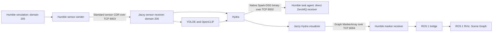

# Jazzy object scene graph in the Humble autonomy stack

Hydra and semantic inference remain in `workspaces/ws_scene_graph`, built with ROS 2
Jazzy. Simulation, navigation and the task agent stay on their existing distributions.
The integration currently targets `rmf_unipilot` with either the office or SubT world.

## Transport



Humble and Jazzy use separate ROS domains. Direct sensor subscriptions worked in
testing, but sharing a DDS domain also caused discovery deserialization errors.
The ROS discovery GID changed from [24 bytes in Humble](https://docs.ros.org/en/ros2_packages/humble/api/rmw_dds_common/msg/Gid.html)
to [16 bytes in Jazzy](https://docs.ros.org/en/ros2_packages/jazzy/api/rmw_dds_common/msg/Gid.html).
The relays avoid mixing their discovery traffic. The ROS 1 bridge forwards only
the standard graph markers, without requiring Hydra messages in Noetic.

The sensor sender subscribes only to the allowlist in
`robot_bringup/config/ros2/scene_graph/sensor_bridge.yaml`. It forwards standard
serialized messages without image compression or depth conversion:

- `/rmf_unipilot/cam/rgb`: `rgb8`, 480 × 270, 20 Hz.
- `/rmf_unipilot/cam/depth`: `32FC1`, metres, matching resolution, pose and rate.
- Both CameraInfo topics, `/tf`, `/tf_static` and `/clock`.

It combines static transforms from all publishers and periodically repeats them
and calibration messages. Jazzy publishes static TF with transient-local durability.
Hydra gets the body-to-optical transform from TF and uses `map` for world poses.
Keep `SCENE_GRAPH_DOMAIN_ID` different from `DOMAIN_ID`. The defaults are 206 and 205.
All runtime services share host networking and IPC, including diagnostic containers.

## Build and run

Import `repos/ws_scene_graph.repos` if the workspace has not already been populated.
Build images and affected workspaces:

```bash
docker buildx bake --allow=network.host --allow=ssh ros2_jazzy_base ros2_hydra ros2_agentic_uas
make build-scene_graph
make build-agentic_uas
```

Run the combined stack:

```bash
make launch DOCKER_COMPOSE_FILE=docker-compose.uav_nmpc_unipilot_scene_graph_sim.yml
```

`SIM_WORLD_PROFILE=office` is the default; `SIM_WORLD_PROFILE=subt` selects the
existing SubT world. Alternatively, launch the usual simulation and add only
the scene graph services in a second terminal:

```bash
make launch DOCKER_COMPOSE_FILE=docker-compose.scene_graph.yml
```

These services use the already-built `robot_bringup` launches and configs in their
respective Jazzy and Humble workspaces. Existing simulations do not launch Hydra
unless the new Compose file is selected.

YOLOE/MobileCLIP weights, OpenCLIP weights and the Hugging Face/CLIP caches persist
under the bind-mounted `workspaces/ws_scene_graph`. The first run requires model
downloads; removing containers does not remove these files. Semantic inference
uses CUDA and samples RGB-D at a configurable minimum interval of 0.4 seconds.
Hydra currently retains mesh, objects and robot trajectory; optional place, room,
frontier and task-keyview modules are disabled in this first integration.

## Agent interface

Hydra's existing C++ `ZmqSink` sends complete Spark-DSG binary graphs directly
from the backend to `tcp://127.0.0.1:8002`. The bringup launch sets the C++ configuration key `enable_zmq_interface=true` and
`zmq_send_mesh=false`. No custom Hydra C++ changes are needed.

The task node owns `SceneGraphReceiver` in `agentic_uas/scene_graph.py`. It polls a
ZeroMQ SUB socket every 0.1 seconds without blocking, keeps only the newest queued
payload, and decodes it into a native `spark_dsg.DynamicSceneGraph`. Each complete
snapshot replaces `self.scene_graph`, including node deletions and Hydra restarts.
Semantic attributes, positions, oriented bounding boxes, edges and metadata remain
available without converting through JSON or a ROS graph topic. Mesh is excluded;
other native attributes, including available embeddings, are preserved.

The agent's nested `scene_graph` Spark-Config dataclass configures `enabled`,
`endpoint` and `poll_interval`. Reception is optional, does not delay startup, and
continues while the agent is idle. Status reports native node and edge counts;
`scene_graph_sequence` is a **local count of received updates**, not a Hydra sequence.
The graph is not yet included in VLM input or used to select navigation targets.

The native wire format has no ROS frame/timestamp or session envelope. Coordinates
follow Hydra's configured `map_frame` (`map` here); node attributes retain their own
native timestamps. A late or restarted agent gets the graph on the next backend
update. Unlike the removed JSON exporter, the native sender does not periodically
replay a cached graph when the backend is completely inactive.

The Humble image compiles Python 3.10 bindings from the exact Spark-DSG source in
`workspaces/ws_scene_graph/src/spark_dsg`, also used by Jazzy Hydra. This library is
ROS-independent. Jazzy's Python 3.12 extension cannot be loaded by the Humble agent.
Rebuild the agent image when the Spark-DSG source/binary format changes.

## Verification

Run the integration check in the running Humble agent container:

```bash
docker cp scripts/check_scene_graph.py "$(docker ps --filter label=com.docker.compose.service=ros2_launch_agentic_uas --format '{{.ID}}'):/tmp/check_scene_graph.py"
make attach-agentic_uas
python3 /tmp/check_scene_graph.py
```

The check subscribes directly to the native binary stream and requires actual
semantic objects, unique IDs, finite positions, valid edges/bounding boxes, no mesh,
and matching node/edge counts in agent status.
The robot must have a usable view of recognizable objects within Hydra's depth range.

Validated in the office world with Humble domain 216 and Jazzy domain 217:
24 scene graph packages built; relayed RGB/depth measured 20 Hz with aligned optical
TF; Hydra produced three chair/desk objects; the Humble agent cached the same graph
(sequence 129, 322 nodes and 318 edges). All 42 agent package tests passed, and
receiver/exporter restarts recovered graph snapshots and static TF.
The object-extraction test held the simulated camera at a fixed elevated viewpoint
using a temporary static robot fixture. Production robot models and
planning/control behavior were not changed. SubT is configured but not tested here.

## ROS 1 graph visualization

The existing scene graph services also relay `/hydra_visualizer/graph`
(`visualization_msgs/MarkerArray`) from Jazzy to Humble over TCP 8004, then through
the unipilot ROS 1 bridge. The launched `rmf_unipilot.rviz` configuration includes
an enabled **Scene Graph** display for native nodes, edges, semantic labels and
object bounding boxes. Mesh topics are neither relayed nor added to RViz.
The latest drawing is retained and replayed every second, allowing the ROS 1
bridge or RViz to start after Hydra.

After updating, rebuild `robot_bringup` in both ROS 2 workspaces with
`make build-scene_graph` and `make build-agentic_uas`, then restart the combined
launch so the ROS 1 bridge loads its updated topic list.

Validated with the office simulation: a ROS 1 subscriber received native graph
nodes/edges, chair/desk labels and bounding boxes in `map`, without mesh markers.
Late-starting marker senders recovered Hydra's retained drawing; restarting the
Humble receiver and ROS 1 bridge also recovered it after sensor input stopped.

## Repeated TF time jumps

The installed ROS 1 bridge creates bidirectional topic bridges even when the YAML
declares a direction. Its echo suppression specifically checks the ROS 1 caller
name `/ros_bridge`. The topic process in `start_agentic_bridge.sh` must keep that
name; the separate service process can use `/ros_bridge_services`.
Renaming the topic process echoes old `/clock` and TF data into Humble and then
Jazzy, repeatedly clearing Hydra's TF buffer. Fixing the launch name removed
639 backward clock jumps observed during a 10-second simulation test: the same
test then had zero jumps and duplicate clocks, and semantic graph markers reached
ROS 1. The bridge script is bind-mounted, so this correction only needs a relaunch.

Validated the direct transport in the office world: Humble received 255 native
nodes, three semantic objects and 251 edges, matching the task agent's cache;
mesh was absent and ROS 1 still received chair/desk graph markers. All 43 agent
tests passed, including native snapshot deletion, preservation of semantic
attributes, rejection of obsolete text payloads, and publisher reconnection.
Restarting the actual Hydra and task-agent containers recovered a fresh object
graph through the same native connection.
