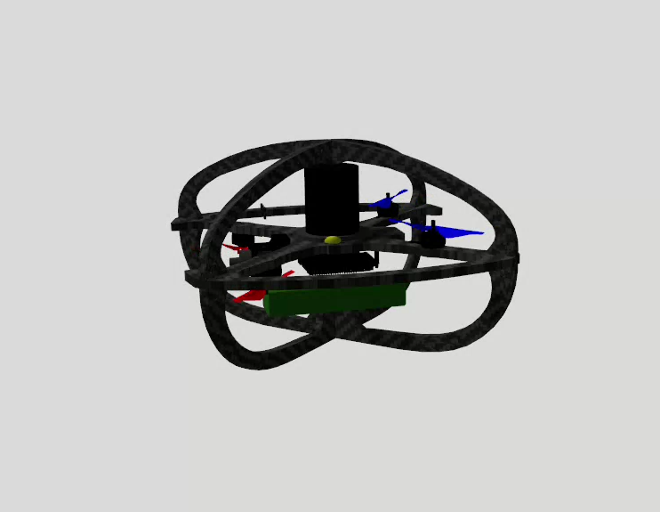
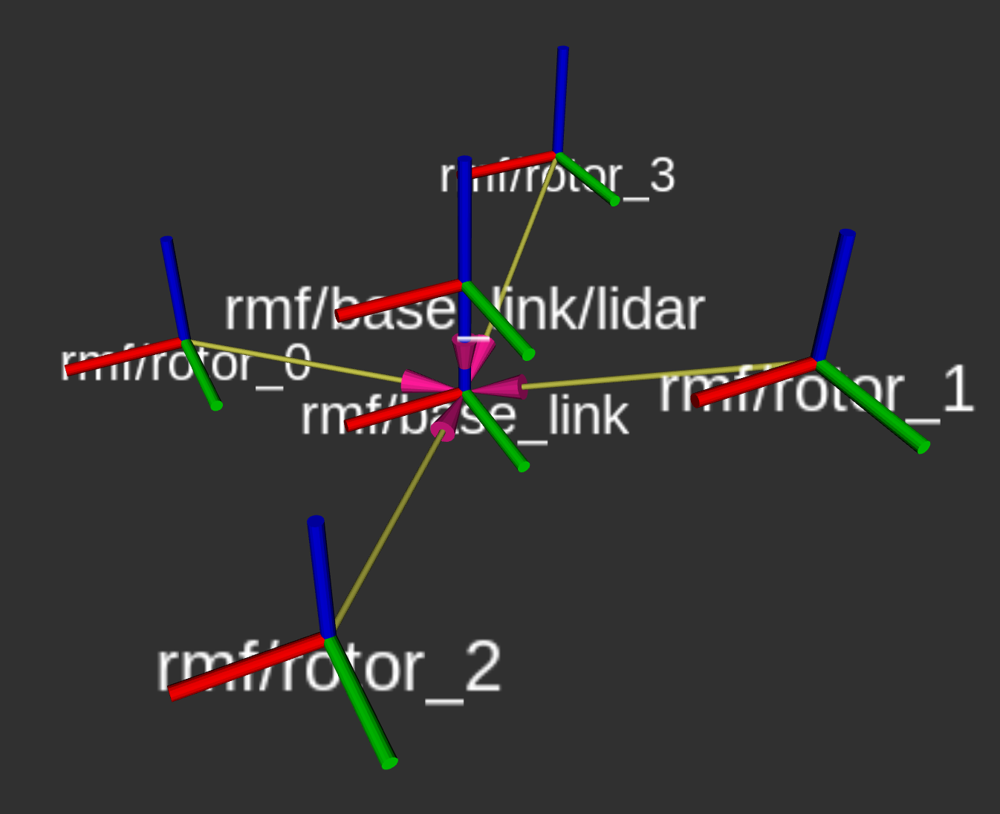

# Simulation

The Simulation environment utilizes **Gazebo** and **Aerial Gym Simulator**. Gazebo is used to test and validate the complete autonomy stack in realistic 3D environments, while Aerial Gym Simulator provides a massively parallelized environment for training data-driven and learning-based methods.

## Gazebo

We provide ROS 2 simulators for multi-rotor and differntial drive wheeled robot integrated with the Unified Autonomy Stack. Both simulators are located in the `unified_autonomy_stack/workspaces/ws_sim` workspace.

### Multirotor Simulator

The [multirotor simulator](https://github.com/ntnu-arl/rmf_gz/tree/dev/unified_autonomy_stack) consists of the ROS 2 package `unified_autonomy_stack/workspaces/ws_sim/src/rmf_gz`.
The simulator provides two robots each carrying a color camera, a depth camera, and a LiDAR sensor. The difference is in the type of lidar onboard the robot.
For both robots, the following sensors and control options are setup. `<ns>` referes to the namespace for that robot.

Sensors:

| Sensor                        | Topic              | Data type                     | Rate (Hz) |
| ----------------------------- | ------------------ | ------------------------      | -- |
| Color camera                  | `/<ns>/cam/rgb`     | `sensor_msgs/msg/Image`       | 10 |
| Depth camera (Image)          |`/<ns>/cam/depth`    | `sensor_msgs/msg/Image`       | 30 |
| Depth camera (Point Cloud)    | `/<ns>/cam/pc`      | `sensor_msgs/msg/PointCloud2` | 30 |
| LiDAR                         |`/<ns>/lidar/points` | `sensor_msgs/msg/PointCloud2` | 10 |

Control Options

| Command Type  | Topic | Data type |
| ------------- | ----- | --------- |
| Velocity      | `/<ns>/cmd/vel` | `geometry_msgs/msg/Twist` |
| Acceleration  | `/<ns>/cmd/vel` | `geometry_msgs/msg/Twist` |

#### Sensor configuration 1: Traditional LiDAR

Robot namespace (`<ns>`): `rmf`

LiDAR configuration:

- Field of View: `360 x 90 deg`
- Orientation: 

#### Sensor configuration 2: Dome LiDAR

Robot namespace (`<ns>`): `rmf_unipilot`

LiDAR configuration:

- Field of View: Dome `360 x 90 deg`
- Orientation: 

### Wheeled Robot Simulator

The [wheeled robot simulator](https://github.com/ntnu-arl/ugv_gz/tree/dev/unified_autonomy_stack) consists of the ROS 2 package `unified_autonomy_stack/workspaces/ws_sim/src/ugv_gz`.
The simulator provides a differential drive wheeled robot carrying a color camera, a depth camera, and a LiDAR sensor. 

The following sensors and control options are setup.

Sensors:

| Sensor                        | Topic              | Data type                     | Rate (Hz) |
| ----------------------------- | ------------------ | ------------------------      | -- |
| Color camera                  | `smb_arl/cam/rgb`     | `sensor_msgs/msg/Image`       | 10 |
| Depth camera (Image)          |`smb_arl/cam/depth`    | `sensor_msgs/msg/Image`       | 30 |
| Depth camera (Point Cloud)    | `smb_arl/cam/pc`      | `sensor_msgs/msg/PointCloud2` | 30 |
| LiDAR                         |`smb_arl/lidar/points` | `sensor_msgs/msg/PointCloud2` | 10 |

Control Options

| Command Type  | Topic | Data type |
| ------------- | ----- | --------- |
| Velocity      | `smb_arl/cmd/vel` | `geometry_msgs/msg/Twist` |

## Aerial Gym Simulator

The [Aerial Gym Simulator](https://github.com/ntnu-arl/aerial_gym_simulator) is an open-source simulator for massively parallelized simulation of multirotor platforms.

<iframe width="560" height="315" src="https://www.youtube.com/embed/VBVBQNtHZoc?si=fKTiwZZlOuz0k59U" title="YouTube video player" frameborder="0" allow="accelerometer; autoplay; clipboard-write; encrypted-media; gyroscope; picture-in-picture; web-share" referrerpolicy="strict-origin-when-cross-origin" allowfullscreen></iframe>

To train policies for the autonomy stack, a dedicated training task description is set up within the simulator and can be found [here]. This includes the environment setup, reward formulation, obstacle management and episode management. The training task uses a simulated quadrotor platform with a dome LiDAR sensor placed, facing backwards.
