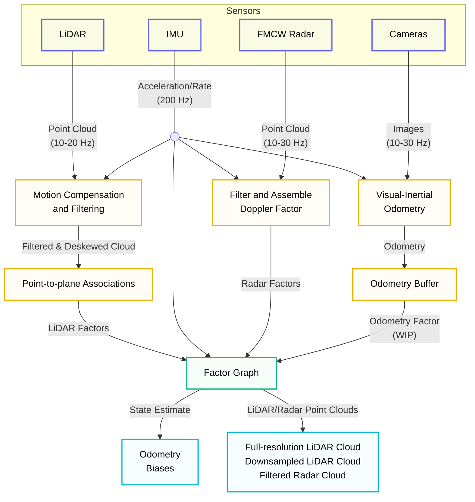

# Multi-Modal SLAM

The perception layer provides robust state estimation and mapping through [MIMOSA](https://github.com/ntnu-arl/mimosa) (Multi-modal Inertial Odometry and SLAM), a factor graph-based fusion framework designed for robust performance across challenging environments.

!!! note "Source Code"
    - **Workspace:** `workspaces/ws_mimosa/src`
    - **Package:** `mimosa`
    - **GitHub:** [ntnu-arl/mimosa](https://github.com/ntnu-arl/mimosa)

**Related Publications:**

- [Khedekar, N. and Alexis, K. "PG-LIO: Photometric-Geometric fusion for Robust LiDAR-Inertial Odometry." arXiv preprint arXiv:2506.18583, 2025.](http://arxiv.org/abs/2506.18583)
- [Nissov, M., Edlund, J.A., Spieler, P., Padgett, C., Alexis, K., and Khattak, S. "Robust High-Speed State Estimation for Off-Road Navigation Using Radar Velocity Factors." IEEE Robotics and Automation Letters, vol. 9, no. 12, pp. 11146-11153, 2024.](https://doi.org/10.1109/lra.2024.3486189)
- [Nissov, M., Khattak, S., Edlund, J.A., Padgett, C., Alexis, K., and Spieler, P. "ROAMER: Robust Offroad Autonomy using Multimodal State Estimation with Radar Velocity Integration." 2024 IEEE Aerospace Conference, pp. 1-10, 2024.](https://ieeexplore.ieee.org/document/10521170)
- [Nissov, M., Khedekar, N., and Alexis, K. "Degradation Resilient LiDAR-Radar-Inertial Odometry." 2024 IEEE International Conference on Robotics and Automation (ICRA), pp. 8587-8594, 2024.](https://ieeexplore.ieee.org/document/10611444)

## System Overview



## Sensors

The stack fuses multiple sensor modalities for robust perception in diverse environments:

### LiDAR (Ouster OS0-128) or (RoboSense RS-AIRY)

- **Frequency**: 10-20 Hz (configurable)
- **Output**: Point cloud with per-point:
    - 3D position
    - Timestamp

### Radar (TI mmWave)

- **Type**: Millimeter-wave radar
- **Frequency**: Variable (typically 10-30 Hz)
- **Output**: Point cloud with per-point:
    - 3D Position
    - Radial speed

### Inertial Measurement Unit (IMU)

- **Model**: VectorNav VN-100 (or equivalent)
- **Frequency**: 200 Hz
- **Outputs**:
    - Specific force
    - Angular velocity

### Cameras (Experimental)

- **Frequency**: Variable
- **Output**: RBG or grayscale

## Factor Graph Optimization

The backend maintains a sliding-window factor graph for calculating the state estimate, using the fixed lag smoother from the [GTSAM](https://github.com/borglab/gtsam) library.

**State Space:**

$$
\mathbf{x}_k = \begin{bmatrix} \boldsymbol{p}_k, &\boldsymbol{q}_k, &\boldsymbol{v}_k, &\boldsymbol{b}_k^a, &\boldsymbol{b}_k^\omega,   &\boldsymbol{g} \end{bmatrix}^{\top}
$$

where $\boldsymbol{p}_k$ is the position, $\boldsymbol{q}_k$ is the attitude quaternion, $\boldsymbol{v}_k$ is the linear velocity, $\boldsymbol{b}_k^a$, $\boldsymbol{b}_k^\omega$ are accelerometer and gyroscope biases, and $\boldsymbol{g}$ is the gravity direction.

**Factor Types:**

1. **Prior Factors:**
    - Initializing entire state space
    - Relevant parameters: `graph/smoother/initial_*`

2. **IMU Preintegration Factors** (between exteroceptive measurements):
    - Links consecutive graph nodes using integrated IMU measurements
    - Relevant parameters: `imu/*`

3. **LiDAR Odometry Factors** (point-to-plane residuals):
    - Unary Hessian factor containing all the scan-map point-to-plane residuals
    - Relevant parameters: `lidar/*`

4. **Radar Factors** (radial speed residuals)
    - Unary Hessian factor containing all the radial speed residuals
    - Relevant parameters: `radar/*`

5. **External Odometry** (experimental):
    - Binary factor encoding relative transform between two pose estimates from an external odometry sources (e.g., from visual-inertial odometry)
    - Relevant parameters: `odometry/*`

## Topics

Topics are remapped in the launch file. Note, all topics are in the `/mimosa_node` namespace.

### Input

| Topic                           | Type                      | Source                                                                        |
| ------------------------------- | ------------------------- | ----------------------------------------------------------------------------- |
| `/imu/manager/imu_in`           | `sensor_msgs/Imu`         | IMU driver (e.g., `vectornav_driver`)                                         |
| `/lidar/manager/lidar_in`       | `sensor_msgs/PointCloud2` | LiDAR driver (e.g., `ouster_ros`, `rslidar_sdk`)                              |
| `/radar/manager/radar_in`       | `sensor_msgs/PointCloud2` | Radar driver (e.g., `ti_mmwave_rospkg`); fields: [x, y, z, radial_speed]      |
| `/odometry/manager/odometry_in` | `nav_msgs/Odometry`       | External odometry (e.g., VIO from [rovio](https://github.com/ethz-asl/rovio)) |

### Output

| Topic                            | Type                      | Description                                                                                                  |
| -------------------------------- | ------------------------- | ------------------------------------------------------------------------------------------------------------ |
| `/graph/odometry`                | `nav_msgs/Odometry`       | Graph-rate odometry; provided to [MSF](https://github.com/ethz-asl/ethzasl_msf) to create IMU-rate estimates |
| `/graph/path`                    | `nav_msgs/Path`           | Graph-rate path; visualization                                                                               |
| `/graph/optimized_path`          | `nav_msgs/Path`           | Smoother window path; visualization                                                                          |
| `/lidar/manager/points_full_res` | `sensor_msgs/PointCloud2` | Deskewed full-resolution LiDAR; visualization                                                                |
| `/lidar/geometric/sm_cloud_ds`   | `sensor_msgs/PointCloud2` | Downsampled deskewed LiDAR; provided to planner                                                              |
| `/radar/manager/filtered_points` | `sensor_msgs/PointCloud2` | Filtered radar points; visualization                                                                         |

## Configuration & Tuning

Parameters most likely to need changes for a new system. Noise parameters are assumed to be calibrated (e.g., Allan Variance for IMU) or manually tuned.

### Graph Optimization

All parameters use the `graph/smoother` prefix.

#### Initial Covariance

| Parameter                               | Description                                  |
| --------------------------------------- | -------------------------------------------- |
| `initial_position_sigma`                | Position standard deviation (m)              |
| `initial_rotation_yaw_sigma_deg`        | Yaw standard deviation (deg)                 |
| `initial_rotation_pitch_roll_sigma_deg` | Roll/pitch standard deviation (deg)          |
| `initial_velocity_sigma`                | Linear velocity standard deviation (m/s)     |
| `initial_bias_acc_sigma`                | Accelerometer bias standard deviation (m/s²) |
| `initial_bias_gyro_sigma`               | Gyroscope bias standard deviation (rad/s)    |
| `initial_gravity_sigma`                 | Gravity direction standard deviation         |

#### Optimization

| Parameter                           | Description                                         |
| ----------------------------------- | --------------------------------------------------- |
| `lag`                               | Fixed lag smoother temporal duration (s)            |
| `relinearize_threshold_translation` | Position relinearization threshold (m)              |
| `relinearize_threshold_rotation`    | Attitude relinearization threshold (rad)            |
| `relinearize_threshold_velocity`    | Velocity relinearization threshold (m/s)            |
| `relinearize_threshold_bias_acc`    | Accelerometer bias relinearization threshold (m/s²) |
| `relinearize_threshold_bias_gyro`   | Gyroscope bias relinearization threshold (rad/s)    |
| `relinearize_threshold_gravity`     | Gravity relinearization threshold                   |
| `additional_update_iterations`      | Additional Gauss-Newton iterations (int)            |

### Extrinsic Calibration

For each source in [`lidar`, `radar`, `odometry`]:

| Parameter        | Description                                                      |
| ---------------- | ---------------------------------------------------------------- |
| `<source>/T_B_S` | Transform from source to body frame: `[x, y, z, qx, qy, qz, qw]` |

### IMU

All parameters use the `imu/preintegration` prefix.

| Parameter               | Description                                |
| ----------------------- | ------------------------------------------ |
| `acc_noise_density`     | Accelerometer noise density (m/(s²√Hz))    |
| `acc_bias_random_walk`  | Accelerometer bias random walk (m/(s³√Hz)) |
| `gyro_noise_density`    | Gyroscope noise density (rad/(s√Hz))       |
| `gyro_bias_random_walk` | Gyroscope bias random walk (rad/(s²√Hz))   |

### LiDAR

Parameters with `lidar/manager` prefix:

| Parameter                                  | Description                                |
| ------------------------------------------ | ------------------------------------------ |
| `range_min`                                | Minimum range (m)                          |
| `range_max`                                | Maximum range (m)                          |
| `create_full_res_pointcloud`               | Publish full-resolution point cloud (bool) |
| `full_res_pointcloud_publish_rate_divisor` | Full-res publish rate divisor (uint)       |

Parameters with `lidar/geometric` prefix:

| Parameter                               | Description                         |
| --------------------------------------- | ----------------------------------- |
| `map_keyframe_trans_thresh`             | Keyframe translation threshold (m)  |
| `map_keyframe_rot_thresh_deg`           | Keyframe rotation threshold (deg)   |
| `scan_to_map/lidar_point_noise_std_dev` | Point-to-plane residual std dev (m) |

### Radar

All parameters use the `radar/manager` prefix.

| Parameter                 | Description                          |
| ------------------------- | ------------------------------------ |
| `range_min`               | Minimum range (m)                    |
| `range_max`               | Maximum range (m)                    |
| `threshold_azimuth_deg`   | Maximum absolute azimuth (deg)       |
| `threshold_elevation_deg` | Maximum absolute elevation (deg)     |
| `frame_ms`                | Chirp duration (ms)                  |
| `noise_sigma`             | Doppler residual noise std dev (m/s) |

### External Odometry

All parameters use the `odometry/manager` prefix.

| Parameter       | Description                   |
| --------------- | ----------------------------- |
| `sigma_trans_m` | Translation noise std dev (m) |
| `sigma_rot_deg` | Rotation noise std dev (deg)  |

---

## Citation

If you use this method in your work, please cite the relevant publications:

```bibtex
@misc{perception_pglio,
    title = {{PG}-{LIO}: {Photometric}-{Geometric} fusion for {Robust} {LiDAR}-{Inertial} {Odometry}},
    shorttitle = {{PG}-{LIO}},
    url = {http://arxiv.org/abs/2506.18583},
    doi = {10.48550/arXiv.2506.18583},
    publisher = {arXiv},
    author = {Khedekar, Nikhil and Alexis, Kostas},
    month = jun,
    year = {2025},
    note = {arXiv:2506.18583 [cs]},
    keywords = {Computer Science - Robotics},
}

@ARTICLE{perception_jplRadar,
    author={Nissov, Morten and Edlund, Jeffrey A. and Spieler, Patrick and Padgett, Curtis and Alexis, Kostas and Khattak, Shehryar},
    journal={IEEE Robotics and Automation Letters}, 
    title={Robust High-Speed State Estimation for Off-Road Navigation Using Radar Velocity Factors}, 
    year={2024},
    volume={9},
    number={12},
    pages={11146-11153},
    keywords={Radar;Sensors;Velocity measurement;Radar measurements;Laser radar;Odometry;State estimation;Robustness;Robot sensing systems;Field robots;localization;sensor fusion},
    doi={10.1109/lra.2024.3486189}
}

@inproceedings{perception_roamer,
	title = {{ROAMER}: {Robust} {Offroad} {Autonomy} using {Multimodal} {State} {Estimation} with {Radar} {Velocity} {Integration}},
	shorttitle = {{ROAMER}},
	url = {https://ieeexplore.ieee.org/document/10521170},
	doi = {10.1109/AERO58975.2024.10521170},
	booktitle = {2024 {IEEE} {Aerospace} {Conference}},
	author = {Nissov, Morten and Khattak, Shehryar and Edlund, Jeffrey A. and Padgett, Curtis and Alexis, Kostas and Spieler, Patrick},
	month = mar,
	year = {2024},
	note = {ISSN: 1095-323X},
	keywords = {Hardware, Laser radar, Radar measurements, Robustness, Sensor systems, Sensors, Vehicle driving},
	pages = {1--10},
}

@inproceedings{perception_dlrio,
	title = {Degradation {Resilient} {LiDAR}-{Radar}-{Inertial} {Odometry}},
	url = {https://ieeexplore.ieee.org/document/10611444},
	doi = {10.1109/ICRA57147.2024.10611444},
	booktitle = {2024 {IEEE} {International} {Conference} on {Robotics} and {Automation} ({ICRA})},
	author = {Nissov, Morten and Khedekar, Nikhil and Alexis, Kostas},
	month = may,
	year = {2024},
	keywords = {Degradation, Estimation, Laser radar, Odometry, Prevention and mitigation, Robot sensing systems, Sensors},
	pages = {8587--8594},
}
```
