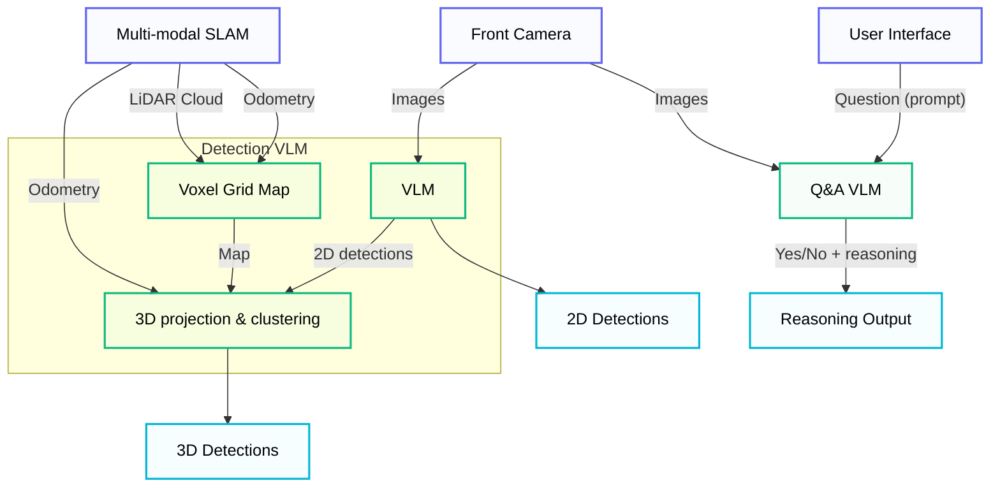

# Visual Language Model (VLM) Reasoning

The system currently integrates two complementary
vision-language model (VLM) modalities:

- Open-vocabulary object detection with 3D spatial grounding.
- Binary visual question-answering (Yes/No) with reasoning. 

In their combination, these capabilities collectively enable semantic scene understanding and reasoning from visual data.

!!! note "Source Code"
    - **Workspace:** `workspaces/ws_vlm/src`
    - **Package:** `detection_vlm`
    - **GitHub:** [ntnu-arl/detection_vlm](https://github.com/ntnu-arl/detection_vlm)

## System Overview

The VLM stack is designed to run alongside the core perception and planning modules, providing semantic annotations and reasoning.

The following diagram describes the entities in the VLM system along with the data exhange within and outside the system.



### Detection VLM

Object detection is performed using either an open-vocabulary object detector (YOLOe) or a VLM-based detector (GPT-4V via API call) initialized with a set of labels or a description of the objects to detect. These models operate on the front camera image and produce 2D bounding boxes. In parallel, a downsampled voxel grid derived from the LiDAR point cloud and our SLAM odometry estimate is maintained. Accordingly, LiDAR points are projected into the camera frame using the current pose estimate and the camera projection matrix. Valid points are clustered to identify those that fall within each 2D detection/mask. This produces aligned 2D detections and corresponding 3D bounding volumes.

### Q&A VLM

For high-level semantic assessment, a VLM (GPT-4V via API call) processes the front-camera image together with a binary “Yes/No” question. For example, queries related to assessing safety or navigation-related properties of the scene (e.g., is the exit of this environment blocked). The model returns the binary answer, alongside a color-coded confidence overlay on the input image, and a brief explanation of its reasoning.

---

## Topics & Interfaces

Topics are remapped in the launch file. Note, all topics are in the ```/detection_vlm``` or ```/reasoning_vlm``` namespaces.

### Input Topics

#### Detection VLM

| Topic              | Type                                                 | Description      |
| ------------------ | ---------------------------------------------------- | ---------------- |
| `input_image`      | `sensor_msgs/Image` or `sensor_msgs/CompressedImage` | Input image      |
| `input_pointcloud` | `sensor_msgs/PointCloud2`                            | Input Pointcloud |

#### Q&A VLM

| Topic         | Type                                                 | Description |
| ------------- | ---------------------------------------------------- | ----------- |
| `input_image` | `sensor_msgs/Image` or `sensor_msgs/CompressedImage` | Input image |

### Input Frames (for TF querying)

#### Detection VLM

| Frame name     | Description        |
| -------------- | ------------------ |
| `target_frame` | Target world frame |
| `camera_frame` | Camera frame       |
| `body_frame`   | Body/IMU frame     |

### Output Topics

#### Detection VLM

| Topic                     | Type                             | Description                                |
| ------------------------- | -------------------------------- | ------------------------------------------ |
| `detections_image`        | `sensor_msgs/Image`              | 2D detections overlayed on the input image |
| `accumulated_pointcloud`  | `sensor_msgs/PointCloud2`        | Accumulated voxel grid map                 |
| `detected_bboxes_3d`      | `vision_msgs/BoundingBox3DArray` | 3D detections                              |
| `visualization_3d_bboxes` | `visualization_msgs/MarkerArray` | 3D detections for visualization            |

#### Q&A VLM

| Topic          | Type                | Description                                                                                  |
| -------------- | ------------------- | -------------------------------------------------------------------------------------------- |
| `output_image` | `sensor_msgs/Image` | Color-coded confidence overlay on the input image and brief explanation of the VLM reasoning |

### Services (Input)

#### Q&A VLM

 | Service      | Type                           | Description                                            |
 | ------------ | ------------------------------ | ------------------------------------------------------ |
 | `set_prompt` | `detection_vlm_msgs/SetPrompt` | Prompt used by the VLM, it should be a Yes/No question |

## Configuration

### Detection VLM

Parameters are set in:

- YOLOe: `detection_vlm/detection_vlm_ros/config/detection_yoloe.yaml`
- GPT-4V: `detection_vlm/detection_vlm_ros/config/detection_vlm.yaml`

Topics and frame remappings are set in:

- `detection_vlm/detection_vlm_ros/launch/detection_vlm.launch.yaml`

#### VLM

| Parameter                            | Description                                                                                                                |
| ------------------------------------ | -------------------------------------------------------------------------------------------------------------------------- |
| `vlm/type`                           | Which vlm to use: `yoloe` or `openai`                                                                                      |
| `vlm/model` (YOLOe)                  | Model to use (see [here](https://docs.ultralytics.com/models/yoloe/#available-models-supported-tasks-and-operating-modes)) |
| `vlm/confidence_threshold` (YOLOe)   | Detection confidence threshold                                                                                             |
| `vlm/verbose` (YOLOe)                | If `True`, prints inference statistics                                                                                     |
| `vlm/confidence_threshold` (YOLOe)   | Detection confidence threshold                                                                                             |
| `vlm/cuda` (YOLOe)                   | Whether to use cuda                                                                                                        |
| `vlm/client_config/model` (OpenAI)   | Model to use                                                                                                               |
| `prompt` (OpenAI)                    | Detection prompt. Specify/describe objects to detect                                                                       |

#### Image worker

| Parameter                 | Description                                                        |
| ------------------------- | ------------------------------------------------------------------ |
| `worker/min_separation_s` | Processing process: take an image every `min_separation_s` seconds |
| `compressed_image`        | Wether the input image topic is compressed                         |

#### Voxel map and clustering

| Parameter                | Description                                                     |
| ------------------------ | --------------------------------------------------------------- |
| `voxel_size`             | Map voxel size (m)                                              |
| `min_points_per_cluster` | Minimum number of points a cluster must have                    |
| `eps_dbscan`             | DBSCAN epsilon parameter (m)                                    |
| `min_point_r`            | Filter out points closer than this value to the body frame (m)  |
| `max_point_r`            | Filter out points further than this value to the body frame (m) |

#### Camera intrinsics

| Parameter              | Description       |
| ---------------------- | ----------------- |
| `camera_intrinsics/fx` | x focal length    |
| `camera_intrinsics/fy` | y focal length    |
| `camera_intrinsics/cx` | x principal point |
| `camera_intrinsics/cy` | y principal point |

#### Others

| Parameter                  | Description                                                                   |
| -------------------------- | ----------------------------------------------------------------------------- |
| `use_tf_current_time`      | `False`: use message stamp to query TF. `True`: use current time to query TF. |
| `use_masks_for_projection` | Whether to use masks when projecting to 3D. Otherwise use bounding boxes.     |
| `verbose`                  | Whether to print timings and info.                                            |

### Q&A VLM 

Parameters are set in `detection_vlm/detection_vlm_ros/config/reasoning_vlm.yaml`.

Topics and frame remmapings are set in `detection_vlm/detection_vlm_ros/launch/reasoning_vlm.launch.yaml`.

#### VLM

| Parameter                            | Description                                          |
| ------------------------------------ | ---------------------------------------------------- |
| `vlm/type`                           | Which vlm to use: only `openai` is supported for now |
| `vlm/type`                           | Which vlm to use: only `openai` is supported for now |
| `vlm/client_config/model` (OpenAI)   | Model to use                                         |
| `prompt` (OpenAI)                    | Detection prompt. Specify/describe objects to detect |

#### Image worker

| Parameter                 | Description                                                        |
| ------------------------- | ------------------------------------------------------------------ |
| `worker/min_separation_s` | Processing process: take an image every `min_separation_s` seconds |
| `compressed_image`        | Wether the input image topic is compressed                         |

#### Visualization

| Parameter       | Description                                           |
| --------------- | ----------------------------------------------------- |
| `overlay_alpha` | Alpha used for the color-coded overlay.               |
| `footer_height` | Foother height for the reasoning on the output image. |

#### Others

| Parameter       | Description                                          |
| --------------- | ---------------------------------------------------- |
| `footer_height` | Footer height for the reasoning on the output image. |
| `verbose`       | Whether to print timings and info.                   |
