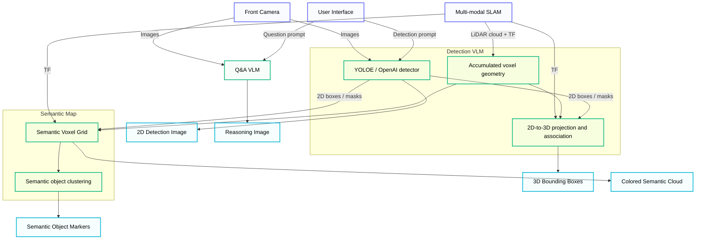

# Visual Language Model (VLM) Reasoning

The VLM stack integrates three complementary vision-language capabilities:

- Open-vocabulary object detection with 3D spatial grounding.
- Persistent semantic mapping from image detections and LiDAR geometry.
- Binary visual question-answering with reasoning.

Together, these modules provide object-level detections, a semantic voxel map, clustered semantic objects, and high-level scene reasoning from robot camera and LiDAR data.

!!! note "Source Code"
    - **Workspace:** `workspaces/ws_vlm/src`
    - **Package:** `detection_vlm`
    - **GitHub:** [ntnu-arl/detection_vlm](https://github.com/ntnu-arl/detection_vlm)


## Related Publications

- [Dharmadhikari, M. et. al. "The Unified Autonomy Stack: Toward a Blueprint for Generalizable Robot Autonomy." arXiv preprint arXiv:2605.12735, 2026.](https://arxiv.org/abs/2605.12735)

## System Overview

The VLM stack runs alongside the core perception and planning modules. It consumes camera images, LiDAR point clouds, calibration, and TF, then publishes semantic annotations for downstream autonomy and user-facing visualization.


```mermaid
graph TB

    FC["Front Camera"]
    SLAM["Multi-modal SLAM"]
    UI["User Interface"]

    subgraph Detection["Detection VLM"]
        Detector["YOLOE / OpenAI detector"]
        GeometryMap["Accumulated voxel geometry"]
        Projection3D["2D-to-3D projection and association"]
    end

    subgraph SemanticMap["Semantic Map"]
        SemanticUpdater["Semantic Voxel Grid"]
        ObjectClusters["Semantic object clustering"]
    end

    QAVLM["Q&A VLM"]

    Dets2D["2D Detection Image"]
    Dets3D["3D Bounding Boxes"]
    SemanticCloud["Colored Semantic Cloud"]
    SemanticObjects["Semantic Object Markers"]
    ReasonOutput["Reasoning Image"]

    FC -->|"Images"| Detector
    FC -->|"Images"| QAVLM
    SLAM -->|"LiDAR cloud + TF"| GeometryMap
    SLAM -->|"TF"| Projection3D
    SLAM -->|"TF"| SemanticUpdater
    UI -->|"Detection prompt"| Detector
    UI -->|"Question prompt"| QAVLM

    GeometryMap --> Projection3D
    Detector -->|"2D boxes / masks"| Projection3D
    Detector -->|"2D boxes / masks"| SemanticUpdater
    GeometryMap --> SemanticUpdater
    SemanticUpdater --> ObjectClusters

    Detector --> Dets2D
    Projection3D --> Dets3D
    SemanticUpdater --> SemanticCloud
    ObjectClusters --> SemanticObjects
    QAVLM --> ReasonOutput

    classDef input fill:#e0e7ff30,stroke:#6366f1,stroke-width:2px,color:#000
    classDef backend fill:#d1fae530,stroke:#10b981,stroke-width:2px,color:#000
    classDef output fill:#cffafe30,stroke:#06b6d4,stroke-width:2px,color:#000

    class SLAM,FC,UI input
    class Detector,GeometryMap,Projection3D,SemanticUpdater,ObjectClusters,QAVLM backend
    class Dets2D,Dets3D,SemanticCloud,SemanticObjects,ReasonOutput output
```

### Detection VLM

Object detection is performed using either an open-vocabulary detector, currently YOLOE, or an OpenAI VLM detector initialized with a text prompt. The detector operates on the front camera image and produces 2D bounding boxes and, for segmentation-capable YOLOE models, masks.

In parallel, a downsampled voxel map is accumulated from LiDAR points. The node projects map points into the camera frame, associates projected points with each 2D detection, and publishes 3D object bounding volumes. Association can use DBSCAN clustering or a front-surface selection method.

### Semantic Map

The semantic map node uses the same camera, LiDAR, camera info, and TF inputs as the detection node, but accumulates semantic evidence over time. Each image detection updates per-voxel semantic scores in the map. The node publishes:

- a colored semantic point cloud, where each active voxel is colored by its most likely label;
- clustered semantic objects as RViz markers with boxes, connectors, nodes, and labels;
- the annotated 2D detections image used for map updates.

Semantic scores can be updated using additive counters or Bayesian updates. Active-window parameters limit projection work to a local region around the robot for runtime control.

### Q&A VLM

For high-level semantic assessment, an OpenAI VLM processes the front-camera image together with a binary question. Example questions include whether an exit is blocked or whether an area appears safe. The node publishes a color-coded overlay image with the answer probability and a short textual explanation.

---

## Launch Files

### ROS 1 Noetic

| Module | Launch file | Default config |
| --- | --- | --- |
| Detection VLM | `detection_vlm/detection_vlm_ros/launch/detection_vlm.launch` | `detection_vlm/detection_vlm_ros/config/detection_yoloe.yaml` |
| Semantic Map | `detection_vlm/detection_vlm_ros/launch/semantic_map.launch` | `detection_vlm/detection_vlm_ros/config/semantic_mapping_yoloe.yaml` |
| Semantic Map, site-specific NENE setup | `detection_vlm/detection_vlm_ros/launch/semantic_map_nene.launch` | `detection_vlm/detection_vlm_ros/config/semantic_mapping_yoloe.yaml` |
| Q&A VLM | `detection_vlm/detection_vlm_ros/launch/reasoning_vlm.launch` | `detection_vlm/detection_vlm_ros/config/reasoning_vlm.yaml` |

### ROS 2 Humble

| Module | Launch file | Default config |
| --- | --- | --- |
| Detection VLM | `detection_vlm/detection_vlm_ros/launch/detection_vlm.launch.yaml` | `detection_vlm/detection_vlm_ros/config/detection_yoloe.yaml` |
| Semantic Map | `detection_vlm/detection_vlm_ros/launch/semantic_map.launch.yaml` | `detection_vlm/detection_vlm_ros/config/semantic_mapping_yoloe.yaml` |
| Q&A VLM | `detection_vlm/detection_vlm_ros/launch/reasoning_vlm.launch.yaml` | `detection_vlm/detection_vlm_ros/config/reasoning_vlm.yaml` |

OpenAI-backed modes require:

```bash
export OPENAI_API_KEY=<Your OpenAI API key>
```

---

## Topics & Interfaces

Topics are remapped in the launch files. The default namespaces are `/detection_vlm`, `/semantic_map`, and `/reasoning_vlm`.

### Detection VLM

#### Input Topics

| Topic | ROS 1 type | ROS 2 type | Description |
| --- | --- | --- | --- |
| `/detection_vlm/input_image` | `sensor_msgs/Image` or `sensor_msgs/CompressedImage` | `sensor_msgs/msg/Image` or `sensor_msgs/msg/CompressedImage` | Front camera image |
| `/detection_vlm/input_pointcloud` | `sensor_msgs/PointCloud2` | `sensor_msgs/msg/PointCloud2` | LiDAR point cloud |
| `/detection_vlm/input_camera_info` | `sensor_msgs/CameraInfo` | `sensor_msgs/msg/CameraInfo` | Camera intrinsics and distortion |

#### Output Topics

| Topic | ROS 1 type | ROS 2 type | Description |
| --- | --- | --- | --- |
| `/detection_vlm/detections_image` | `sensor_msgs/Image` | `sensor_msgs/msg/Image` | 2D detections overlaid on the input image |
| `/detection_vlm/accumulated_pointcloud` | `sensor_msgs/PointCloud2` | `sensor_msgs/msg/PointCloud2` | Accumulated voxel geometry map |
| `/detection_vlm/detected_bboxes_3d` | `vision_msgs/BoundingBox3DArray` | `vision_msgs/msg/BoundingBox3DArray` | 3D object bounding boxes |
| `/detection_vlm/visualization_3d_bboxes` | `visualization_msgs/MarkerArray` | `visualization_msgs/msg/MarkerArray` | RViz markers for 3D boxes and labels |
| `/detection_vlm/debug_clusters_pointcloud` | `sensor_msgs/PointCloud2` | `sensor_msgs/msg/PointCloud2` | Optional colored point clusters used for 3D association |

#### Service

| Service | ROS 1 type | ROS 2 type | Description |
| --- | --- | --- | --- |
| `/detection_vlm/set_prompt` | `detection_vlm_msgs/SetPrompt` | `detection_vlm_msgs/srv/SetPrompt` | Update the detection prompt at runtime |

### Semantic Map

#### Input Topics

| Topic | ROS 1 type | ROS 2 type | Description |
| --- | --- | --- | --- |
| `/semantic_map/input_image` | `sensor_msgs/Image` or `sensor_msgs/CompressedImage` | `sensor_msgs/msg/Image` or `sensor_msgs/msg/CompressedImage` | Front camera image |
| `/semantic_map/input_pointcloud` | `sensor_msgs/PointCloud2` | `sensor_msgs/msg/PointCloud2` | LiDAR point cloud used to build map geometry |
| `/semantic_map/input_camera_info` | `sensor_msgs/CameraInfo` | `sensor_msgs/msg/CameraInfo` | Camera intrinsics and distortion |

#### Output Topics

| Topic | ROS 1 type | ROS 2 type | Description |
| --- | --- | --- | --- |
| `/semantic_map/detections_image` | `sensor_msgs/Image` | `sensor_msgs/msg/Image` | 2D detections used to update the semantic map |
| `/semantic_map/semantic_map` | `sensor_msgs/PointCloud2` | `sensor_msgs/msg/PointCloud2` | Colored semantic voxel cloud, latched/transient-local |
| `/semantic_map/semantic_objects` | `visualization_msgs/MarkerArray` | `visualization_msgs/msg/MarkerArray` | Clustered semantic object markers, latched/transient-local |

#### Service

| Service | ROS 1 type | ROS 2 type | Description |
| --- | --- | --- | --- |
| `/semantic_map/set_prompt` | `detection_vlm_msgs/SetPrompt` | `detection_vlm_msgs/srv/SetPrompt` | Update the semantic detection prompt at runtime |

### Q&A VLM

#### Input Topics

| Topic | ROS 1 type | ROS 2 type | Description |
| --- | --- | --- | --- |
| `/reasoning_vlm/input_image` | `sensor_msgs/Image` or `sensor_msgs/CompressedImage` | `sensor_msgs/msg/Image` or `sensor_msgs/msg/CompressedImage` | Front camera image |

#### Output Topics

| Topic | ROS 1 type | ROS 2 type | Description |
| --- | --- | --- | --- |
| `/reasoning_vlm/output_image` | `sensor_msgs/Image` | - | Color-coded answer/confidence image in ROS 1 |
| `/reasoning_vlm/reasoning_image` | - | `sensor_msgs/msg/Image` | Color-coded answer probability image in ROS 2 |

#### Service

| Service | ROS 1 type | ROS 2 type | Description |
| --- | --- | --- | --- |
| `/reasoning_vlm/set_prompt` | `detection_vlm_msgs/SetPrompt` | `detection_vlm_msgs/srv/SetPrompt` | Update the yes/no question at runtime |

### TF Frames

| Parameter | Description |
| --- | --- |
| `target_frame` | World or navigation frame where the geometry and semantic maps are accumulated |
| `camera_frame` | Camera optical frame used for projecting map points into the image |
| `body_frame` | Robot body or IMU frame used for range filtering and active-window localization |

ROS 1 expects TF to provide the point cloud frame to `body_frame`, the point cloud frame to `target_frame`, and `target_frame` to `camera_frame`.

ROS 2 keeps the LiDAR-to-body extrinsic in YAML as `lidar_to_body_transform`, then queries TF for `body_frame` to `target_frame` and `target_frame` to `camera_frame`.

---

## Configuration

### Common Model Parameters

| Parameter | Description |
| --- | --- |
| `vlm/type` | Detector or reasoner backend. Detection supports `yoloe` and `openai`; reasoning uses `openai`. |
| `vlm/model` | YOLOE model name or local weight path. |
| `vlm/confidence_threshold` | YOLOE detection threshold. |
| `vlm/output_size` | YOLOE inference image size. |
| `vlm/cuda` | Whether YOLOE inference should use CUDA. |
| `vlm/client_config/model` | OpenAI model name. |
| `vlm/system_prompt_path` | Path to the system prompt loaded by the launch file. |
| `prompt` | Detection prompt or yes/no reasoning question. |
| `classes_file` | Optional class list for YOLOE models that support setting custom classes. |

### Image Worker

| Parameter | Description |
| --- | --- |
| `worker/min_separation_s` | Minimum time between processed images. |
| `worker/queue_size` | Image worker queue size. |
| `compressed_image` | If `True`, subscribe to compressed images. |

### Detection VLM

Parameters are set in:

- ROS 1 YOLOE: `detection_vlm/detection_vlm_ros/config/detection_yoloe.yaml`
- ROS 1 OpenAI: `detection_vlm/detection_vlm_ros/config/detection_vlm.yaml`
- ROS 2 YOLOE: `detection_vlm/detection_vlm_ros/config/detection_yoloe.yaml`
- ROS 2 OpenAI: `detection_vlm/detection_vlm_ros/config/detection_vlm.yaml`

| Parameter | Description |
| --- | --- |
| `voxel_size` | Geometry map voxel size in meters. |
| `min_points_per_cluster` | Minimum number of projected points required for an association or cluster. |
| `eps_dbscan` | DBSCAN epsilon in meters. |
| `association_method` | `dbscan` or `front_surface`. |
| `front_surface_cell_size_px` | Image grid size used by front-surface association. |
| `front_surface_depth_band` | Absolute depth band for front-surface selection. |
| `front_surface_depth_band_scale` | Relative depth band scale for front-surface selection. |
| `front_surface_depth_percentile` | Percentile used to estimate front depth per image cell. |
| `front_surface_outlier_std_ratio` | Statistical outlier threshold for front-surface points. |
| `min_point_r` | Filter out LiDAR points closer than this distance to `body_frame`. |
| `max_point_r` | Filter out LiDAR points farther than this distance to `body_frame`. |
| `use_masks_for_projection` | Use segmentation masks when available; otherwise use 2D boxes. |
| `publish_debug_clusters` | Publish colored association clusters for debugging. |
| `keep_boxes` | Keep old RViz box markers instead of expiring them. |
| `use_tf_current_time` | If `False`, query TF at the message stamp. If `True`, query latest TF. |
| `verbose` | Print timings and additional information. |

ROS 2 also exposes `confidence_threshold` as a runtime node parameter.

### Semantic Map

Parameters are set in:

- ROS 1: `detection_vlm/detection_vlm_ros/config/semantic_mapping_yoloe.yaml`
- ROS 2: `detection_vlm/detection_vlm_ros/config/semantic_mapping_yoloe.yaml`

| Parameter | Description |
| --- | --- |
| `voxel_size` | Semantic and geometry map voxel size in meters. |
| `association_method` | `dbscan`, `front_surface`, or `none`. |
| `semantic_update_method` | `counter` for additive voting or `bayes` for Bayesian updates. |
| `default_detection_confidence` | Confidence used when a detector output has no confidence. |
| `semantic_publish_min_observations` | Minimum observations before a voxel can be published. |
| `semantic_publish_min_confidence` | Minimum winning-label confidence before a voxel can be published. |
| `semantic_publish_period_s` | Semantic cloud publish period. |
| `publish_semantic_objects` | Enable clustered semantic object markers. |
| `semantic_objects_period_s` | Semantic object marker publish period. |
| `semantic_cluster_eps` | Euclidean clustering radius for semantic objects. |
| `semantic_cluster_min_points` | Minimum points for semantic object clustering. |
| `semantic_object_min_voxels` | Minimum voxels in a semantic object. |
| `semantic_object_min_confidence` | Minimum mean object confidence used by ROS 2 semantic object filtering. |
| `semantic_object_node_height` | Height of semantic object label nodes in RViz. |
| `semantic_object_node_radius` | Radius of semantic object label nodes. |
| `semantic_object_text_offset` | Vertical text offset above object label nodes. |
| `show_confidence` | Include confidence in semantic object label text. |
| `active_window_enabled` | Enable local-window updates around `body_frame`. |
| `active_window_radius_xy` | Active-window radius in the horizontal plane. |
| `active_window_min_z` | Minimum active-window height relative to `body_frame`. |
| `active_window_max_z` | Maximum active-window height relative to `body_frame`. |
| `active_window_apply_to_updates` | Limit semantic updates to the active window. |
| `active_window_apply_to_visualization` | Limit published semantic cloud to the active window. |
| `semantic_visualization_voxel_size` | Extra downsampling size for the published semantic cloud. |
| `semantic_visualization_max_points` | Maximum number of semantic cloud points to publish. |
| `semantic_object_visualization_voxel_size` | Optional downsampling size before object clustering in ROS 2. |
| `max_active_update_points` | Maximum number of map points projected into each image update. |
| `runtime_logging_enabled` | Enable runtime CSV logging. |
| `runtime_log_file` | Runtime CSV path. |

### Camera Calibration

| Parameter | Description |
| --- | --- |
| `camera_intrinsics/fx` | X focal length. |
| `camera_intrinsics/fy` | Y focal length. |
| `camera_intrinsics/cx` | X principal point. |
| `camera_intrinsics/cy` | Y principal point. |
| `distortion_coeffs/k1` | Radial distortion coefficient. |
| `distortion_coeffs/k2` | Radial distortion coefficient. |
| `distortion_coeffs/p1` | Tangential distortion coefficient. |
| `distortion_coeffs/p2` | Tangential distortion coefficient. |

Camera info messages override these values after the first received message.

### ROS 2 LiDAR Extrinsics

The ROS 2 branch keeps LiDAR-to-body calibration in the config files:

| Parameter | Description |
| --- | --- |
| `lidar_to_body_transform/translation/x` | LiDAR translation in `body_frame`. |
| `lidar_to_body_transform/translation/y` | LiDAR translation in `body_frame`. |
| `lidar_to_body_transform/translation/z` | LiDAR translation in `body_frame`. |
| `lidar_to_body_transform/quaternion/x` | LiDAR orientation quaternion. |
| `lidar_to_body_transform/quaternion/y` | LiDAR orientation quaternion. |
| `lidar_to_body_transform/quaternion/z` | LiDAR orientation quaternion. |
| `lidar_to_body_transform/quaternion/w` | LiDAR orientation quaternion. |

### Q&A VLM

Parameters are set in:

- ROS 1: `detection_vlm/detection_vlm_ros/config/reasoning_vlm.yaml`
- ROS 2: `detection_vlm/detection_vlm_ros/config/reasoning_vlm.yaml`

| Parameter | Description |
| --- | --- |
| `overlay` | Enable or disable the colored answer overlay. |
| `overlay_alpha` | Overlay opacity. |
| `footer_height` | Base footer height for text rendering. |
| `runtime_logging_enabled` | Enable runtime CSV logging. |
| `runtime_log_file` | Runtime CSV path. |
| `verbose` | Print timings and additional information. |
